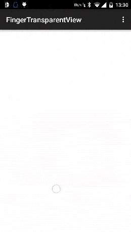

#### 六、ImageView  
1. PhotoView  
支持双击或双指缩放的ImageView，在ViewPager等Scrolling view中正常使用，相比上面的AndroidTouchGallery，不仅支持ViewPager，同时支持单个ImageView  
项目地址：https://github.com/chrisbanes/PhotoView  
Demo地址：https://play.google.com/store/apps/details?id=uk.co.senab.photoview.sample  
APP示例：photup  
   
1. android-gif-drawable  
支持gif显示的view，用jni实现的，编译生成so库后直接xml定义view即可，而且本身不依赖于其他开源项目所以相对下面的ImageViewEx简单的多   
项目地址：https://github.com/koral--/android-gif-drawable  
  
1. ImageViewEx  
支持Gif显示的ImageView  
项目地址：https://github.com/frapontillo/ImageViewEx  
Demo地址：https://github.com/Trinea/TrineaDownload/blob/master/imageviewex-demo.apk?raw=true  
依赖很多，编译过程很繁琐!|_|!
   
1. RoundedImageView  
带圆角的ImageView  
项目地址：https://github.com/vinc3m1/RoundedImageView  
效果图：  
  
   
1. ColorArt  
根据图片的均色设置背景色显示文字和图片，类似itune11中效果  
项目地址：https://github.com/MichaelEvans/ColorArt  
Demo地址：https://github.com/Trinea/TrineaDownload/blob/master/color-art-demo.apk?raw=true  
   
1. CircleImageView  
圆形的ImageView  
项目地址：https://github.com/hdodenhof/CircleImageView  
效果图：  
  
  
1. ImageViewZoom  
支持放大和平移的ImageView   
项目地址：https://github.com/sephiroth74/ImageViewZoom  
APP示例：https://play.google.com/store/apps/details?id=com.aviary.android.feather  
  
1. KenBurnsView  
实现Ken Burns effect效果，达到身临其境效果的ImageView   
项目地址：https://github.com/flavioarfaria/KenBurnsView  

1. CustomShapeImageView    
各种形状的ImageView, 相比上面的圆形ImageView，多了更多形状    
项目地址：https://github.com/MostafaGazar/CustomShapeImageView     
效果图：  
   

1. MovingImageView  
图片可以自动移动的ImageView。  
项目地址：https://github.com/AlbertGrobas/MovingImageView  
效果图：  

1. MultiImageSelector  
相册图片选择，支持多选和单选  
项目地址：https://github.com/lovetuzitong/MultiImageSelector  
效果图：  

1. Android-Ultra-Photo-Selector  
一个图片选择器控件，支持选择多张图片、浏览设备上所有包含图片的文件夹、预览选择的图片并且支持缩放。  
项目地址：https://github.com/AizazAZ/Android-Ultra-Photo-Selector  
效果图：  

1. driveimageview  
一个可以展示文字的ImageView   
项目地址：https://github.com/mrwonderman/driveimageview  
效果图：  

1. FingerTransparentView  
手指区域羽化透明，显示出底部图片布局区域。  
项目地址：https://github.com/drakeet/FingerTransparentView  
   

1. AndroidScrollingImageView  
可以实现视差滚动动画的ImageView   
项目地址：https://github.com/Q42/AndroidScrollingImageView  
   

1. SlidingCard  
漂亮的卡片滑动翻页特效   
项目地址：https://github.com/mxn21/SlidingCard  
   

1. Pixelate  
一个可以将图片像素化显示的自定义ImgeView, 可以做马赛克   
项目地址：https://github.com/DanielMartinus/Pixelate  
   

1. WindowView  
一个可以通过倾斜设备来控制平移的Imageview   
项目地址：https://github.com/justasm/WindowView  
   

1. PinchImageView   
体验最好的图片手势控件，不同分辨率无缝切换，可与ViewPager结合使用,支持双击放大缩小，双指手势，滑动惯性   
项目地址：https://github.com/boycy815/PinchImageView  
   

1. LargeImage   
Android 加载大图 可以高清显示10000*10000像素的图片，轻松实现微博长图功能   
项目地址：https://github.com/LuckyJayce/LargeImage  

