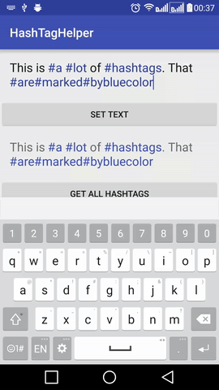
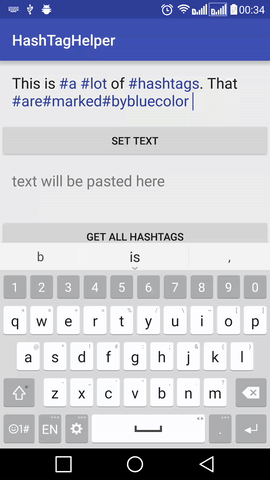
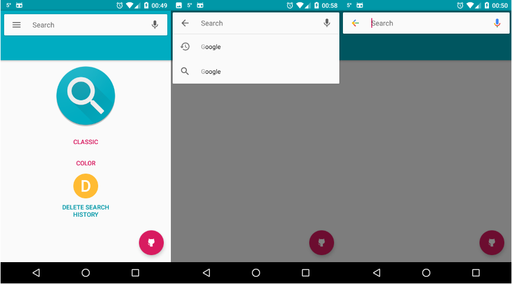
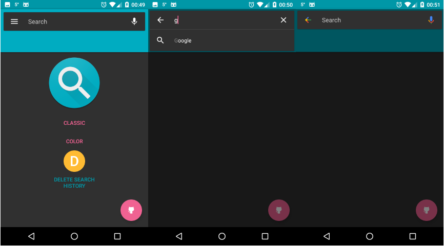
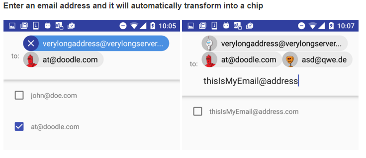
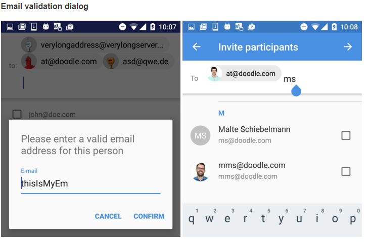

#### 八、TextView  
包括TextView及所有继承自TextView控件，如EditText、Button、RadioButton  

1. android-flowtextview  
文字自动环绕其他View的Layout  
项目地址：https://github.com/deano2390/flowtextview  
效果图：  

1. MixtureTextView  
支持Android图文混排、文字环绕图片等效果的TextView  
项目地址：https://github.com/hongyangAndroid/MixtureTextView  
效果图：  

  
1. Android Form EditText  
验证输入合法性的编辑框，支持输入、英文、ip、url等多种正则验证  
项目地址：https://github.com/vekexasia/android-edittext-validator  
Demo地址：https://play.google.com/store/apps/details?id=com.andreabaccega.edittextformexample  

1. Emojicon  
支持emojis的TextView和EditText    
项目地址：https://github.com/rockerhieu/emojicon  
文档地址：http://rockerhieu.com/emojicon/    

1. android-circlebutton  
Android圆形按钮，实际实现是继承自ImageView  
项目地址：https://github.com/markushi/android-circlebutton   
Demo地址：https://github.com/markushi/android-circlebutton/blob/master/example/example.apk    

1. Segmented Radio Buttons for Android  
iOS’s segmented controls的实现  
项目地址：https://github.com/vinc3m1/android-segmentedradiobutton  
Demo地址：https://github.com/thquinn/DraggableGridView/blob/master/bin/DraggableGridViewSample.apk?raw=true  
效果图：  
  

1. android-segmented-control  
类似于iOS的SegmentedControl。比上面一个更好用，这个使用颜色来定义，上面只是用图片  
项目地址：https://github.com/hoang8f/android-segmented-control  
效果图：   

1. Chips EditText Library  
支持国家名字联想从而选择显示该国国旗的EditText，实际就是通过SpannableStringBuilder实现  
项目地址：https://github.com/kpbird/chips-edittext-library  
Demo地址：https://github.com/kpbird/chips-edittext-library/tree/master/ChipsEditTextDemo/bin   
效果图：   

1. AutoFitTextView  
可固定边界内容字体大小自适应的TextView    
项目地址：https://github.com/grantland/android-autofittextview  

1. Shimmer for Android  
文字发淡光的TextView  
项目地址：https://github.com/RomainPiel/Shimmer-android  
效果图：   

1. Titanic   
可以显示水位上升下降(不知道该怎么描述 囧)的TextView    
项目地址：https://github.com/RomainPiel/Titanic    
效果图：  
   

1. android-iconify  
提供带Icon的TextView,Menu,Button等  
项目地址：https://github.com/JoanZapata/android-iconify  

1. letterpress   
一个方便你在App中应用自定义字体的库。  
项目地址：https://github.com/Pixplicity/letterpress   
效果图：  

1. Calligraphy    
让我们在android开发中使用自定义字体变得更加简单      
项目地址 ：https://github.com/chrisjenx/Calligraphy    
效果图：  
  

1. CreditsRoll  
类似星球大战字幕效果的TextView  
项目地址：https://github.com/frakbot/CreditsRoll  
效果图：  
  

1. android-process-buton  
带加载或提交进度的Button  
项目地址：https://github.com/dmytrodanylyk/android-process-buton  

1. FButton  
扁平化的Button  
项目地址：https://github.com/hoang8f/android-flat-button  
Demo地址：https://play.google.com/store/apps/details?id=info.hoang8f.fbutton.demo  

1. Android-TextView-LinkBuilder  
一个可以让你给TextView的指定文字添加点击Link的库，支持用户点击的时候可以高亮被点击的文字，支持修改高亮文字的透明度，支持通过正则表达式去匹配要添加Link的文字，支持改变Link文字的颜色等。  
项目地址：https://github.com/klinker24/Android-TextView-LinkBuilder  
效果图：  

1. EdittextWithTag  
可以将输入EditText的内容自动转换为一个Tag效果。  
项目地址：https://github.com/pchauhan/EdittextWithTag  
效果图：  
  

1. GridPasswordView  
仿微信/支付宝的密码输入框效果
项目地址：https://github.com/Jungerr/GridPasswordView  
效果图：  
  

1. material-code-input  
一个 Material 风格的 Code 输入框
项目地址：https://github.com/glomadrian/material-code-input  
效果图：  

1. MaterialTextField  
一个漂亮的Floating Edit Text
项目地址：https://github.com/florent37/MaterialTextField  
效果图：   

1. ParkedTextView  
一个支持占位符的EditText
项目地址：https://github.com/gotokatsuya/ParkedTextView  
效果图：  

1. AutosizeEditText  
一个对系统EditText进行了扩展，当输入的文字很多时EditText的大小变化的更加平滑。  
项目地址：https://github.com/txusballesteros/AutosizeEditText  
效果图:   
  

1. android-animate-RichEditor  
一个支持用户插入和删除图片的富文本编辑器，并且有插入和删除图片的动画效果。  
项目地址：https://github.com/xmuSistone/android-animate-RichEditor  
效果图:   

1. RichText   
Android平台下的富文本显示控件，支持Html格式文本、支持图片点击事件、链接自动回调和支持设置加载中和加载错误时的图片。  
项目地址：https://github.com/zzhoujay/RichText  
效果图:  
  

1. HashTagHelper  
一个可以帮助你高亮话题标签("#example")以及捕获点击话题标签事件的库。  
项目地址：https://github.com/Danylo2006/HashTagHelper  
效果图  

  

1. ZoomTextView  
支持手势缩放的自定义 TextView，控件本身和文字都会随着手势同时放大和缩小。  
项目地址：https://github.com/nomanr/ZoomTextView  
效果图  
  

1. HTextView  
效果很赞的 TextView 的文本显示动画。  
项目地址：https://github.com/hanks-zyh/HTextView  
效果图  

1. SearchView  
仿 Google Now 的搜索View控件。  
项目地址：https://github.com/lapism/SearchView  
效果图  
  
  

1. EmphasisTextView  
支持部分文字高亮的 TextView  
项目地址：https://github.com/athkalia/EmphasisTextView  
 

1. android-material-chips  
Material Design 的 Chips 控件实现  
项目地址：https://github.com/DoodleScheduling/android-material-chips  
  
  

