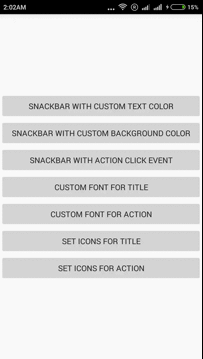

#### 十一、TipView  
包括Toast、角标、UndoBar等提示性控件  

1. Crouton  
丰富样式的Toast，允许alert、comfirm、info样式及点击消失样式，允许设置Toast显示时间，允许自定义View。 本文32. SuperToasts为其扩展版  
项目地址：https://github.com/keyboardsurfer/Crouton  
Demo地址：http://play.google.com/store/apps/details?id=de.keyboardsurfer.app.demo.crouton  
   
1. supertooltips  
带动画效果的Tips显示  
项目地址：https://github.com/nhaarman/supertooltips  
Demo地址：https://play.google.com/store/apps/details?id=com.haarman.supertooltips  
   
1. Android ViewBadger  
为其他View添加角标等  
项目地址：https://github.com/jgilfelt/android-viewbadger  
Demo地址：https://github.com/Trinea/TrineaDownload/blob/master/android-viewbadger.apk?raw=true  
效果图：  
  

1. SuperToasts  
更丰富样式的toast，支持Button、Progress、Horizontal Progress样式、支持进入动画、支持撤销及其动画设置    
项目地址：https://github.com/JohnPersano/SuperToasts  
Demo地址：https://play.google.com/store/apps/details?id=com.supertoastsdemo  
效果图：  
  
  
1. UndoBar  
屏幕底部显示取消或是确认的PopupWindows  
项目地址：https://github.com/soarcn/UndoBar  
效果图：  
  
   
1. Android-UndoBar  
屏幕底部显示取消或是确认某操作  
项目地址：https://github.com/jenzz/Android-UndoBar  
效果图：  
  
   
1. CustomSnackBar  
各种自定义的SnackBar。  
项目地址：https://github.com/TakeoffAndroid/CustomSnackBar  
效果图：  
  
   
1. BubbleView  
一个带箭头的Android气泡控件/容器类，支持在布局中通过自定义属性或代码进行丰富的定制，包括箭头朝向、箭头位置、气泡弧角、边线颜色、边线粗细、颜色填充、填充Padding等等  
项目地址：https://github.com/cpiz/BubbleView  
效果图：  
   
  

