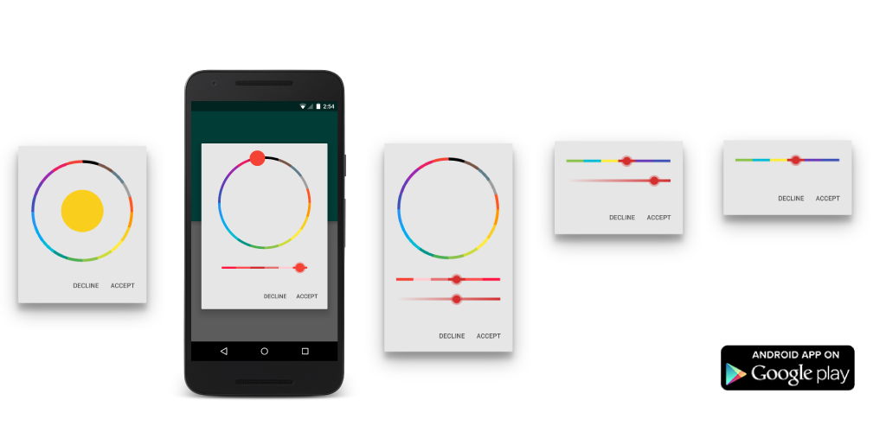

#### 十三、ColorPickView  
1. ColorPickerView  
颜色选择器，支持PopupWindows或新的Activity中打开  
项目地址：https://code.google.com/p/color-picker-view/  
效果图：  
  
   
1. HoloColorPicker  
颜色选择器  
项目地址：https://github.com/LarsWerkman/HoloColorPicker  
Demo地址：https://docs.google.com/file/d/0BwclyDTlLrdXRzVnTGJvTlRfU2s/edit  
  
1. ColorPickerPreference  
颜色选择器  
项目地址：https://github.com/attenzione/android-ColorPickerPreference  
效果图：  
  

1. Lobsterpicker  
Material Design风格的颜色选择器。 
项目地址：https://github.com/LarsWerkman/Lobsterpicker  
效果图：  
  

