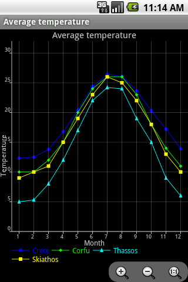
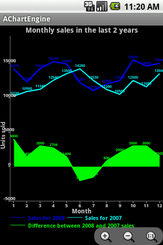
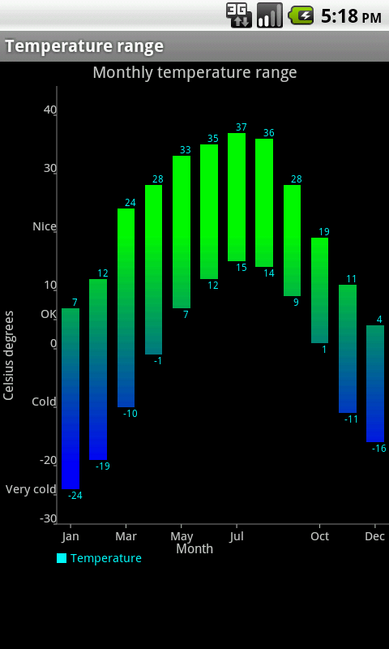
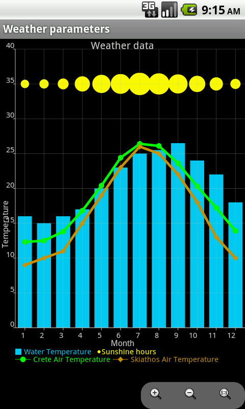
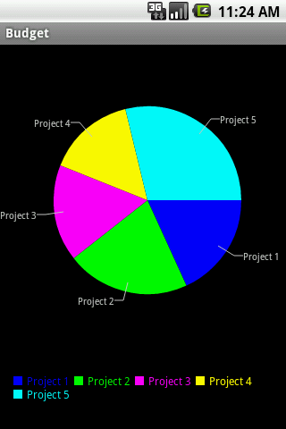

#### 十四、GraphView  
1. achartengine  
强大的图表绘制工具，支持折线图、面积图、散点图、时间图、柱状图、条图、饼图、气泡图、圆环图、范围（高至低）条形图、拨号图/表、立方线图及各种图的结合  
项目地址：https://code.google.com/p/achartengine/  
官方网站：http://www.achartengine.org/  
效果图：  
  
  
  
  
  
APP示例：Wordpress Android，Google Analytics  
   
1. GraphView  
绘制图表和曲线图的View，可用于Android上的曲形图、柱状图、波浪图展示  
项目地址：https://github.com/jjoe64/GraphView  
Demo地址：https://play.google.com/store/apps/details?id=com.sothree.umano  
Demo项目：https://github.com/jjoe64/GraphView-Demos  
APP示例：Wordpress Android，Google Analytics  
  
1. HoloGraphLibrary  
绘制现状图、柱状图、饼状图    
项目地址：https://bitbucket.org/danielnadeau/holographlibrary/src  
文档介绍：https://bitbucket.org/danielnadeau/holographlibrary/wiki/Home  

1. XCL-Charts  
XCL-Charts基于原生的Canvas来绘制各种图表,在设计时，尽量在保证开发效率的同时，给使用者提供足够多的定制化能力。因此使用简便,同时具有相当灵活的定制能力。支持各种图表，其它特性还包括支持手势缩放、图表滑动、点击交互、多图叠加、图表批注、动画效果、多XY轴显示、轴线任意方位显示、动态图例、图表参考线、柱图刻度居中风格切换、混合图表及同数据源图表类型切换等。  
项目地址: https://github.com/xcltapestry/XCL-Charts  
