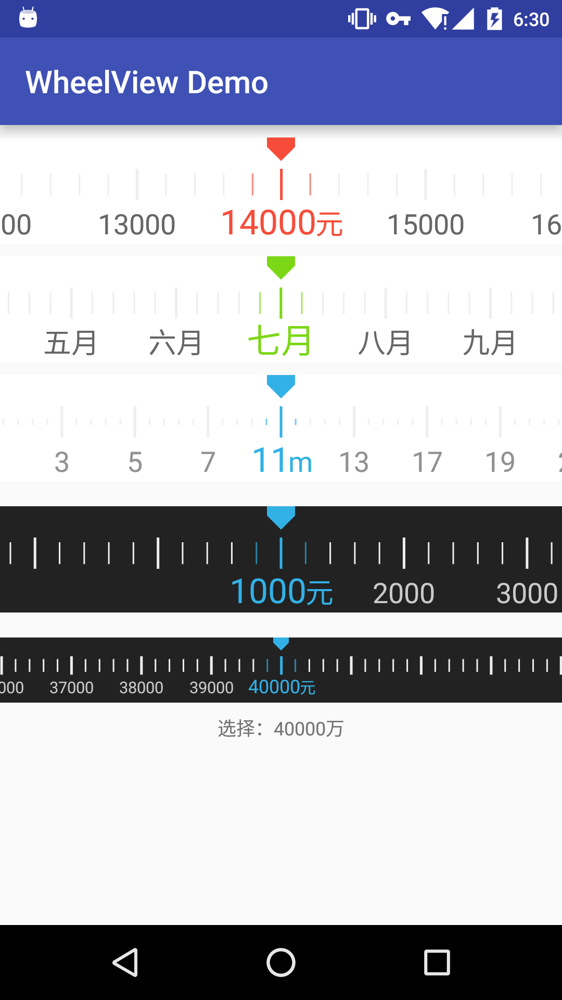
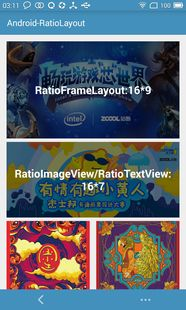
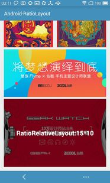
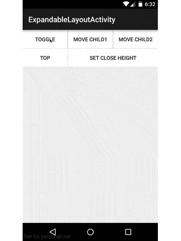
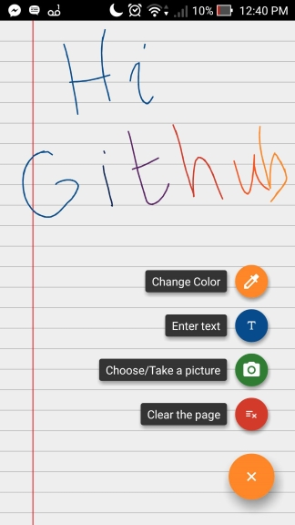
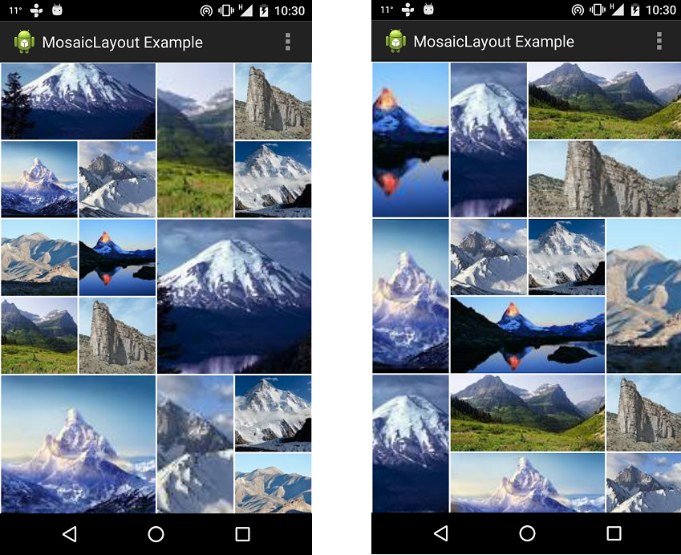
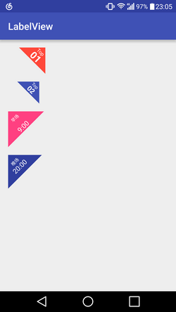
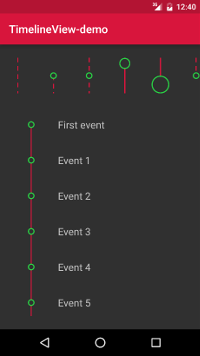

#### 十九 其他

1. AndroidWheel  
android-wheel是Android平台上使用广泛的滚轮选择器，可用于实现日期时间选择器，省市区三级选择菜单等等。  
项目地址：https://github.com/maarek/android-wheel  
效果图：  
  
   
1. PickerUI  
仿iOS的滚轮选择器效果的自定义View，并且支持背景模糊效果。  
项目地址：https://github.com/DavidPizarro/PickerUI  
效果图：  

1. Android-PickerView  
仿iOS的PickerView控件，有时间选择和选项选择并支持一二三级联动效果  
项目地址：https://github.com/saiwu-bigkoo/Android-PickerView  
效果图：  
  

1. WheelView-Android  
一个刻度滚轮控件。  
项目地址：https://github.com/lantouzi/WheelView-Android  
效果图：  
  

1. SwipeBackLayout  
左右或向上滑动返回的Activity  
项目地址：https://github.com/Issacw0ng/SwipeBackLayout  
Demo地址：https://play.google.com/store/apps/details?id=me.imid.swipebacklayout.demo  
效果图： 
APP示例：知乎  
   
1. Android Sliding Up Panel  
可拖动的View，能在当前Activity上扶起一个可拖动的Panel  
项目地址：https://github.com/umano/AndroidSlidingUpPanel  
Demo地址：https://play.google.com/store/apps/details?id=com.sothree.umano  
APP示例：Google Music精简播放栏  
   
1. TableFixHeaders  
第一列固定的Table  
项目地址：https://github.com/InQBarna/TableFixHeaders  
Demo地址：http://bit.ly/13buAIq  
   
1. Inscription  
可用于展示应用change和new feature信息  
项目地址：https://github.com/MartinvanZ/Inscription  
      
1. GlowPadBackport  
将Android4.2的锁屏界面解锁扩展到Android1.6及1.6+  
项目地址：https://github.com/rock3r/GlowPadBackport  
Demo地址：https://play.google.com/store/apps/details?id=net.sebastianopoggi.samples.ui.GlowPadSample  
效果图：  
  

1. GlowPadView  
Android4锁屏界面解锁  
项目地址：https://github.com/nadavfima/GlowPadView  
效果图：  
  
   
1. android-lockpattern  
Android的图案密码解锁  
项目地址：https://github.com/haibison/android-lockpattern  
Demo地址：https://play.google.com/store/apps/details?id=group.pals.android.lib.ui.lockpattern.demo  
使用介绍：https://code.google.com/p/android-lockpattern/wiki/QuickUse  
APP示例：Android开机的图案密码解锁，支付宝的密码解锁  
  
1. ChromeView  
利用Chromium实现的WebView，解决各个Android版本WebView不同的问题，同时利用最新Chrome代码    
项目地址：https://github.com/pwnall/chromeview  
   
1. ShowcaseView library  
用于高亮显示应用程序的特定部分，从而突出突出重点  
项目地址：https://github.com/amlcurran/ShowcaseView   

1. android-segmented-control  
Android上的Segmented Controls，相当于RadioButton组  
项目地址：https://github.com/hoang8f/android-segmented-control   

1. Android-ScalableVideoView  
拥有像ImageView那样的多种缩放类型的VideoView。  
项目地址：https://github.com/yqritc/Android-ScalableVideoView  
效果图：  

1. RearrangeableLayout  
一个可以通过拖动重新排列内部子View的布局。
项目地址：https://github.com/rajasharan/RearrangeableLayout
效果图：  

1. Android-StepsView  
Step By Step的进度指示View，可以定义进度的颜色。  
项目地址：https://github.com/anton46/Android-StepsView    
效果图：  

1. material-animated-switch  
一个material Switch 控件支持ico动画和颜色变换。  
项目地址：https://github.com/glomadrian/material-animated-switch  
效果图：  

1. ProductTour  
Google Drive的视差滚动引导页效果实现.  
项目地址：https://github.com/matrixxun/ProductTour  
效果图：  

1. velocimeter-view  
一个速度指示盘效果的自定义View.  
项目地址：https://github.com/glomadrian/velocimeter-view  
效果图：  

1. WheelIndicatorView   
模仿 Google Fit 的活动指示进度效果.  
项目地址：https://github.com/dlazaro66/WheelIndicatorView  
效果图：  

1. MaterialSpinner  
一个Material Design风格的Spinner，最低支持到2.3系统。  
项目地址：https://github.com/ganfra/MaterialSpinner  
效果图：  

1. AndroidTagGroup  
Android 的Tag Group的库。  
项目地址：https://github.com/2dxgujun/AndroidTagGroup  
效果图：  

1. labelview  
贴纸效果。  
项目地址：https://github.com/linger1216/labelview  
效果图：  

1. DrawableView  
支持手写绘画的自定View，并且可以将绘画的结果保存为图片。  
项目地址：https://github.com/PaNaVTEC/DrawableView  
效果图：  

1. FontDrawable  
可以将 Icon-font 转换为 Drawable 或者 Bitmap 的库。  
项目地址：https://github.com/kazy1991/FontDrawable  
效果图  
  

1. TourGuide
一个可以让你很方便的给App添加操作提示导航的库。    
项目地址：https://github.com/worker8/TourGuide  
效果图：  

1. MusicPlayerView  
漂亮的自定义圆形音乐播放进度条  
项目地址：https://github.com/iammert/MusicPlayerView  
效果图:  

1. CustomActivityOnCrash  
一个在你的App崩溃的时候可以显示一个自定义Activity的库。  
项目地址：https://github.com/Ereza/CustomActivityOnCrash  

1. LandscapeVideoCamera  
强大的自定义 Android Camera，并且支持细粒度的控制视频质量和文件大小  
项目地址：https://github.com/JeroenMols/LandscapeVideoCamera  

1. AndroidSweetSheet  
比例布局。可以设置控件的宽高比  
项目地址：https://github.com/devsoulwolf/Android-RatioLayout  
效果图:  

  

1. FoldingTabBar.Android  
一个可折叠的Tabbar菜单  
项目地址：https://github.com/tosslife/FoldingTabBar.Android  
效果图:  
  

1. ExtendedTouchView  
一个可以增加控件触摸区域的View  
项目地址：https://github.com/lnikkila/ExtendedTouchView   

1. ListViewWithSofPpanel  
模仿微信朋友圈列表中嵌套列表，点某个评论弹出键盘效果  
项目地址：https://github.com/nimengbo/ListViewWithSofPpanel   

1. DraggableView  
这是一个可拖拽的，并在拖拽的时候有旋转、倾斜和缩放的效果的自定义View。  
项目地址: https://github.com/elevenetc/DraggableView  
效果图:  

1. ExpandableLayout  
一个可展开的Layout。  
项目地址: https://github.com/AAkira/ExpandableLayout  
效果图:  
 

1. PianoView  
仿最美应用的钢琴控件。  
项目地址: https://github.com/north2014/PianoView  
效果图:  
 

1. FabricView  
Android的一个画布库，可以实现涂鸦，支持不同画笔。  
项目地址: https://github.com/antwankakki/FabricView   
效果图:  
 

1. android-vertical-slide-view  
仿照淘宝和聚美优品，在商品详情页，向上拖动时，可以加载下一页。使用ViewDragHelper，滑动比较流畅。ScrollView滑动到底部的时候，再行向上拖动时，添加了一些阻力。   
项目地址: https://github.com/xmuSistone/android-vertical-slide-view    
效果图:  

1. Android-UCToast  
UC 浏览器复制，无需权限提示悬浮窗实现   
项目地址: https://github.com/liaohuqiu/android-UCToast    
效果图:  

1. GestureViews  
带有手势控制的ImageView和FrameLayout。这个库的目的是让图片查看尽可能流畅和方便，同时方便开发者把它集成到自己的项目中  
项目地址: https://github.com/alexvasilkov/GestureViews  
效果图:  

1. AndroidMosaicLayout  
马赛克效果 Layout。  
项目地址： https://github.com/adhamenaya/AndroidMosaicLayout  
效果图：  

1. BrokenView  
玻璃碎裂动画效果。  
项目地址： https://github.com/zhanyongsheng/BrokenView    
效果图：  
  

1. LabelView  
一个简单的标签控件。  
项目地址： https://github.com/corerzhang/LabelView    
效果图：  

  

1. GalleryFinal  
Android自定义相册，实现了拍照、图片选择（单选/多选）、 裁剪（单/多裁剪）、旋转、ImageLoader无绑定任由开发者选 择、功能可配置、主题样式可配置。  
项目地址：https://github.com/pengjianbo/GalleryFinal    
效果图：  

  

1. morphy-toolbar  
可以折叠和展开的 Toolbar。  
项目地址：https://github.com/badoualy/morphy-toolbar    
效果图：  

  

1. TimelineView  
漂亮的时间轴自定义 View。  
项目地址：https://github.com/alorma/TimelineView    
效果图：  
  

1. PeekAndPop  
一个模仿iOS中3D Touch效果的库   
项目地址：https://github.com/shalskar/PeekAndPop    
效果图：  
  

1. SwipeSelector  
可以左右滑动切换 item 的 Selector   
项目地址：https://github.com/roughike/SwipeSelector    
效果图：  
  

1. DragScaleCircleView  
一个可拖动可缩放大小的自定义View    
项目地址： https://github.com/hpfs0/DragScaleCircleView    
效果图：  
  

1. MathView   
一个可以在你的 App 里显示数学公式的库。    
项目地址： https://github.com/kexanie/MathView      
效果图：  
  

