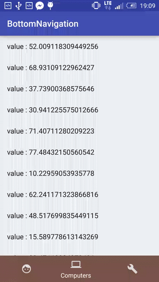
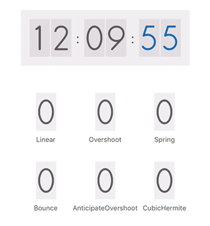

1. LuseenBottomNavigation  
Material Bottom Navigation 实现  
项目地址：https://github.com/armcha/LuseenBottomNavigation  
效果图：
  

1. BottomNavigation  
Material Bottom Navigation 实现  
项目地址：https://github.com/krpiotrek/BottomNavigation  
效果图：  
  

1. NumberMorphView   
数字自动变换的自定义View  
项目地址：https://github.com/me-abhinav/NumberMorphView  
效果图：  
  