## 第一部分 个性化控件(View)  
主要介绍那些不错个性化的View，包括ListView、ActionBar、Menu、ViewPager、Gallery、GridView、ImageView、ProgressBar、TextView、ScrollView、TimeView、TipView、FlipView、ColorPickView、GraphView、UI Style等等。  
、其他  
#### 一、ListView  
1. android-pulltorefresh  
一个强大的拉动刷新开源项目，支持各种控件下拉刷新，ListView、ViewPager、WevView、ExpandableListView、GridView、ScrollView、Horizontal  ScrollView、Fragment上下左右拉动刷新，比下面johannilsson那个只支持ListView的强大的多。并且他实现的下拉刷新ListView在item不足一屏情况下也不会显示刷新提示，体验更好。  
项目地址：https://github.com/chrisbanes/Android-PullToRefresh  
Demo地址：https://github.com/Trinea/TrineaDownload/blob/master/pull-to-refreshview-demo.apk?raw=true  
APP示例：新浪微博各个页面  

1. android-pulltorefresh-listview  
下拉刷新ListView  
项目地址：https://github.com/johannilsson/android-pulltorefresh  
Demo地址：https://github.com/Trinea/TrineaDownload/blob/master/pull-to-refresh-listview-demo.apk?raw=true  
PS：这个被很多人使用的项目实际有不少bug，推荐使用上面的android-pulltorefresh  
   
1. DropDownListView  
下拉刷新及滑动到底部加载更多ListView  
项目地址：https://github.com/Trinea/AndroidCommon  
Demo地址：https://play.google.com/store/apps/details?id=cn.trinea.android.demo  
文档介绍：http://www.trinea.cn/android/dropdown-to-refresh-and-bottom-load-more-listview/  
   
1. DragSortListView  
拖动排序的ListView，同时支持ListView滑动item删除，各个Item高度不一、单选、复选、CursorAdapter做为适配器、拖动背景变化等  
项目地址：https://github.com/bauerca/drag-sort-listview  
Demo地址：https://play.google.com/store/apps/details?id=com.mobeta.android.demodslv  
APP示例：Wordpress Android  
   
1. SwipeListView  
支持定义ListView左右滑动事件，支持左右滑动位移，支持定义动画时间  
项目地址：https://github.com/47deg/android-swipelistview  
Demo地址：https://play.google.com/store/apps/details?id=com.fortysevendeg.android.swipelistview  
APP示例：微信  
   
1. Android-SwipeToDismiss  
滑动Item消失ListView  
项目地址：https://github.com/romannurik/Android-SwipeToDismiss  
支持3.0以下版本见：https://github.com/JakeWharton/SwipeToDismissNOA  
Demo地址：https://github.com/JakeWharton/SwipeToDismissNOA/SwipeToDismissNOA.apk/qr_code  

1. PinnedHeaderExpandableListView  
首先它是一个ExpandableListView，但是它的头部可以固定，其次，在它的上面还有一个头部可以来回伸缩  
项目地址：https://github.com/singwhatiwanna/PinnedHeaderExpandableListView  
APP示例：百度手机卫士垃圾清理界面  
效果图：
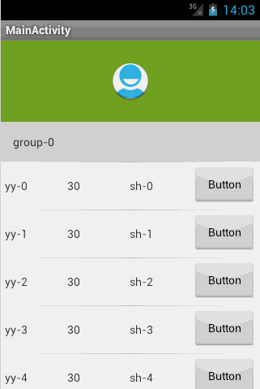  

1. StickyListHeaders  
GroupName滑动到顶端时会固定不动直到另外一个GroupName到达顶端的ExpandListView，支持快速滑动，支持Android2.3及以上  
项目地址：https://github.com/emilsjolander/StickyListHeaders  
APP示例：Android 4.0联系人  
效果图：
  
   
1. pinned-section-listview  
GroupName滑动到顶端时会固定不动直到另外一个GroupName到达顶端的ExpandListView  
项目地址：https://github.com/beworker/pinned-section-listview  
效果图：
  
   
1. PinnedHeaderListView  
GroupName滑动到顶端时会固定不动直到另外一个GroupName到达顶端的ExpandListView  
项目地址：https://github.com/JimiSmith/PinnedHeaderListView  
   
1. QuickReturnHeader  
ListView/ScrollView的header或footer，当向下滚动时消失，向上滚动时出现  
项目地址：https://github.com/ManuelPeinado/QuickReturnHeader  
Demo地址：https://github.com/Trinea/TrineaDownload/blob/master/quick-return-header-demo.apk?raw=true  
APP示例：google plus  
   
1. IndexableListView  
ListView右侧会显示item首字母快捷索引，点击可快速滑动到某个item  
项目地址：https://github.com/woozzu/IndexableListView  
Demo地址：https://github.com/Trinea/TrineaDownload/blob/master/indexable-listview.apk?raw=true  
APP示例：微信通讯录、小米联系人  
   
1. CustomFastScrollView  
ListView快速滑动，同时屏幕中间PopupWindows显示滑动到的item内容或首字母  
项目地址：https://github.com/nolanlawson/CustomFastScrollViewDemo  
效果图：
  
   
1. Android-ScrollBarPanel  
ListView滑动时固定的Panel指示显示在scrollbar旁边  
项目地址：https://github.com/rno/Android-ScrollBarPanel  
效果展示：https://github.com/rno/Android-ScrollBarPanel/raw/master/demo_capture.png  
   
1. SlideExpandableListView  
用户点击listView item滑出固定区域，其他item的区域收缩  
项目地址：https://github.com/tjerkw/Android-SlideExpandableListView  
Demo地址：https://github.com/Trinea/TrineaDownload/blob/master/slide-expandable-listView-demo.apk?raw=true  
   
1. JazzyListView  
ListView及GridView item以特殊动画效果进入屏幕，效果包括grow、cards、curl、wave、flip、fly等等  
项目地址：https://github.com/twotoasters/JazzyListView  
Demo地址：https://play.google.com/store/apps/details?id=com.twotoasters.jazzylistview.sample  
效果展示：http://lab.hakim.se/scroll-effects/  
   
1. ListViewAnimations  
带Item显示动画的ListView，动画包括底部飞入、其他方向斜飞入、下层飞入、渐变消失、滑动删除等  
项目地址：https://github.com/nhaarman/ListViewAnimations  
Demo地址：https://play.google.com/store/apps/details?id=com.haarman.listviewanimations  
APP示例：Google plus、Google Now卡片式进入、小米系统中应用商店、联系人、游戏中心、音乐、文件管理器的ListView、Ultimate、Light Flow Lite、TreinVerkeer、Running Coach、Pearl Jam Lyrics、Calorie Chart、Car Hire、Super BART、DK FlashCards、Counter Plus、Voorlees Verhaaltjes 2.0  
   
1. DevsmartLib-Android  
横向ListView  
项目地址：https://github.com/dinocore1/DevsmartLib-Android  
Demo地址：https://github.com/Trinea/TrineaDownload/blob/master/horizontal-listview-demo.apk?raw=true  
   
1. HorizontalVariableListView  
支持Item宽度不一致的ListView  
项目地址：https://github.com/sephiroth74/HorizontalVariableListView   
   
1. LinearListView  
用LinearLayout实现的ListView，可解决多个ListView并且等问题。目前自己也有需要，等亲自尝试过后会再具体介绍  
项目地址：https://github.com/frankiesardo/LinearListView   
  
1. MultiChoiceAdapter  
支持多选的ListView Adapter  
项目地址：https://github.com/ManuelPeinado/MultiChoiceAdapter   
Demo地址：https://play.google.com/store/apps/details?id=com.manuelpeinado.multichoiceadapter.demo  

1. EnhancedListView  
支持横向滑动滑动删除列表项以及撤销删除的ListView，该项目的前身是[SwipeToDismissUndoList](https://github.com/timroes/SwipeToDismissUndoList)   
项目地址：https://github.com/timroes/EnhancedListView   
Demo地址：https://play.google.com/store/apps/details?id=de.timroes.android.listviewdemo&rdid=de.timroes.android.listviewdemo   
   
1. ListBuddies  
自动滚动的双列ListView ，两个ListView滚动速度不一致，有视差效果   
项目地址：https://github.com/jpardogo/ListBuddies   
Demo地址：https://play.google.com/store/apps/details?id=com.jpardogo.android.listbuddies   
效果展示：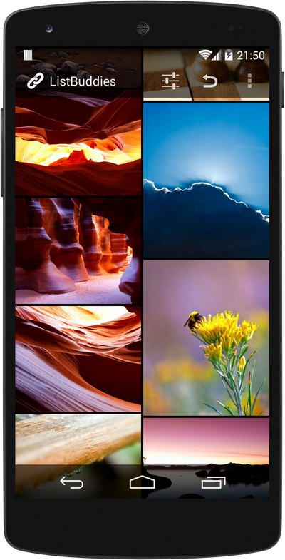  

1. WaterDropListView   
个性化下拉刷新，上拉加载的ListView   
项目地址：https://github.com/THEONE10211024/WaterDropListView    
效果展示：  

1. CircleRefreshLayout   
一个漂亮的自定义下拉刷新布局，水滴效果的下拉刷新动画。   
项目地址：https://github.com/tuesda/CircleRefreshLayout  
效果展示：  

1. SortableTableView   
支持按列排序的TableView   
项目地址：https://github.com/ISchwarz23/SortableTableView  
效果展示：  

#### 二、ActionBar  
1. ActionBarSherlock  
为Android所有版本提供统一的ActionBar，解决4.0以下ActionBar的适配问题  
项目地址：https://github.com/JakeWharton/ActionBarSherlock  
Demo地址：https://play.google.com/store/apps/details?id=com.actionbarsherlock.sample.demos  
APP示例：太多了。。现在连google都在用  
   
1. ActionBar-PullToRefresh  
下拉刷新，ActionBar出现加载中提示  
项目地址：https://github.com/chrisbanes/ActionBar-PullToRefresh  
Demo地址：https://play.google.com/store/apps/details?id=uk.co.senab.actionbarpulltorefresh.samples.stock  
APP示例：Gmail，Google plus，知乎等  
   
1. FadingActionBar  
ListView向下滚动逐渐显现的ActionBar  
项目地址：https://github.com/ManuelPeinado/FadingActionBar  
Demo地址：https://play.google.com/store/apps/details?id=com.manuelpeinado.fadingactionbar.demo  
APP示例：google music，知乎  
   
1. NotBoringActionBar  
google music下拉收缩的ActionBar  
项目地址：https://github.com/flavienlaurent/NotBoringActionBar  
Demo地址：http://flavienlaurent.com/blog/2013/11/20/making-your-action-bar-not-boring/  
APP示例：Google音乐  
   
1. RefreshActionItem  
带进度显示和刷新按钮的ActionBar  
项目地址：https://github.com/ManuelPeinado/RefreshActionItem  
Demo地址：https://play.google.com/store/apps/details?id=com.manuelpeinado.refreshactionitem.demo  
APP示例：The New York Times，DevAppsDirect.  
   
1. GlassActionBar  
类似玻璃的有一定透明度的ActionBar  
项目地址：https://github.com/ManuelPeinado/GlassActionBar  
Demo地址：https://play.google.com/store/apps/details?id=com.manuelpeinado.glassactionbardemo  
APP示例：google music  

#### 三、Menu   
1. MenuDrawer   
滑出式菜单，通过拖动屏幕边缘滑出菜单，支持屏幕上下左右划出，支持当前View处于上下层，支持Windows边缘、ListView边缘、ViewPager变化划出菜单等。  
项目地址：https://github.com/SimonVT/android-menudrawer  
Demo地址：http://simonvt.github.io/android-menudrawer/  
APP示例：Gmail、Google Music等大部分google app  
   
1. SlidingMenu  
滑出式菜单，通过拖动屏幕边缘滑出菜单，支持屏幕左右划出，支持菜单zoom、scale、slide up三种动画样式出现。  
项目地址：https://github.com/jfeinstein10/SlidingMenu  
Demo地址：https://play.google.com/store/apps/details?id=com.slidingmenu.example  
APP示例：Foursquare, LinkedIn, Zappos, Rdio, Evernote Food, Plume, VLC for Android, ESPN ScoreCenter, MLS MatchDay, 9GAG, Wunderlist 2, The Verge, MTG Familiar, Mantano Reader, Falcon Pro (BETA), MW3 Barracks  
MenuDrawer和SlidingMenu比较：SlidingMenu支持菜单动画样式出现，MenuDrawer支持菜单view处于内容的上下层  
   
1. ArcMenu  
支持类似Path的左下角动画旋转菜单及横向划出菜单、圆心弹出菜单  
项目地址：https://github.com/daCapricorn/ArcMenu  
APP示例：Path  
效果图：
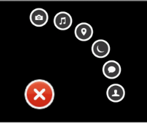  
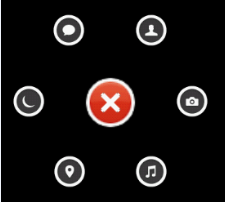  
  
   
1. android-satellite-menu  
类似Path的左下角动画旋转菜单  
项目地址：https://github.com/siyamed/android-satellite-menu  
Demo地址：https://github.com/Trinea/TrineaDownload/blob/master/satellite-menu-demo.apk?raw=true  
APP示例：Path  
   
1. radial-menu-widget  
圆形菜单，支持二级菜单  
项目地址：https://code.google.com/p/radial-menu-widget/  
效果图：
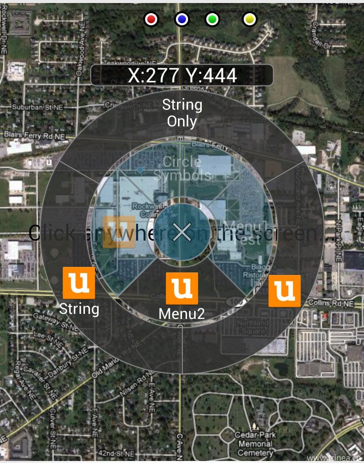  
   
1. Android Wheel Menu  
圆形旋转选取菜单  
项目地址：https://github.com/anupcowkur/Android-Wheel-Menu  
效果图：
  
   
1. FoldingNavigationDrawer  
滑动并以折叠方式打开菜单  
项目地址：https://github.com/tibi1712/FoldingNavigationDrawer-Android  
Demo地址：https://play.google.com/store/apps/details?id=com.ptr.folding.sample  
效果图：
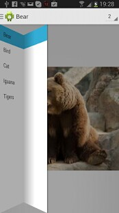  

1. AndroidResideMenu  
仿 Dribbble 的边栏菜单   
项目地址：https://github.com/SpecialCyCi/AndroidResideMenu    
效果图：    

1. ExpandableSelector  
ExpandableSelector is an Android library created to show a list of Button/ImageButton widgets inside a animated container which can be collapsed or expanded.  
项目地址：https://github.com/Karumi/ExpandableSelector  
效果图：

1. GuillotineMenu-Android  
一个铡刀效果的自定义菜单。  
项目地址：https://github.com/Yalantis/GuillotineMenu-Android  
效果图：  
  

1. DropDownMenu  
类似58同城的多条件过滤筛选效果。  
项目地址：https://github.com/JayFang1993/DropDownMenu  
效果图：  

1. FilterMenu   
圆形菜单。  
项目地址：https://github.com/linroid/FilterMenu  
效果图：  
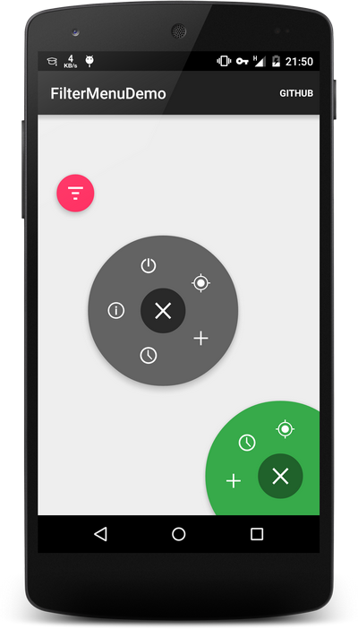

1. BlurredGridMenu   
毛玻璃背景效果的网格菜单。  
项目地址：https://github.com/gotokatsuya/BlurredGridMenu  
效果图：  

1. Android-CircleMenu   
自定义ViewGroup实现的圆形旋转菜单，支持跟随手指旋转以及快速旋转。  
项目地址：https://github.com/hongyangAndroid/Android-CircleMenu  
效果图：  

1. MultiCardMenu   
一个交互方式比较新颖的卡片菜单。  
项目地址：https://github.com/wujingchao/MultiCardMenu  
效果图：  

#### 四、ViewPager 、Gallery  
1. Android-ViewPagerIndicator  
配合ViewPager使用的Indicator，支持各种位置和样式  
项目地址：https://github.com/JakeWharton/Android-ViewPagerIndicator  
Demo地址：https://play.google.com/store/apps/details?id=com.viewpagerindicator.sample  
APP示例：太多了。。  
   
1. JazzyViewPager  
支持Fragment切换动画的ViewPager，动画包括转盘、淡入淡出、翻页、层叠、旋转、方块、翻转、放大缩小等  
项目地址：https://github.com/jfeinstein10/JazzyViewPager  
Demo地址：https://github.com/jfeinstein10/JazzyViewPager/blob/master/JazzyViewPager.apk?raw=true  
效果类似桌面左右切换的各种效果，不过桌面并非用ViewPager实现而已  
   
1. Android-DirectionalViewPager  
支持横向和纵向(垂直)的ViewPager  
项目地址：https://github.com/JakeWharton/Android-DirectionalViewPager  
Demo地址：https://market.android.com/details?id=com.directionalviewpager.sample  
   
1. android-pulltorefresh  
支持下拉刷新的ViewPager  
项目地址：https://github.com/chrisbanes/Android-PullToRefresh  
Demo地址：https://github.com/Trinea/TrineaDownload/blob/master/pull-to-refreshview-demo.apk?raw=true  
APP示例：新浪微博各个页面  
   
1. FancyCoverFlow  
支持Item切换动画效果的类似Gallery View  
项目地址：https://github.com/davidschreiber/FancyCoverFlow  
Demo地址：https://play.google.com/store/apps/details?id=at.technikum.mti.fancycoverflow.samples  
效果图：
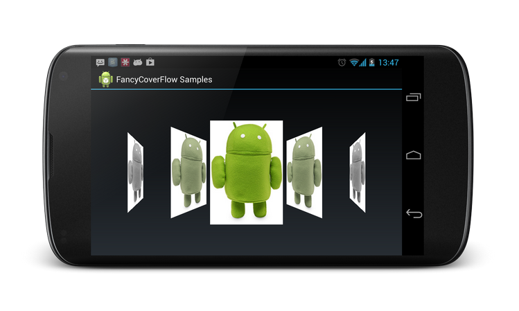  
   
1. AndroidTouchGallery  
支持双击或双指缩放的Gallery(用ViewPager实现)，相比下面的PhotoView，在被放大后依然能滑到下一个item，并且支持直接从url和文件中获取图片，  
项目地址：https://github.com/Dreddik/AndroidTouchGallery  
Demo地址：https://github.com/Trinea/TrineaDownload/blob/master/touch-gallery-demo.apk?raw=true  
APP示例：类似微信中查看聊天记录图片时可双击放大，并且放大情况下能正常左右滑动到前后图片  
   
1. Android Auto Scroll ViewPager  
Android自动滚动 轮播循环的ViewPager  
项目地址：https://github.com/Trinea/android-auto-scroll-view-pager  
Demo地址：https://play.google.com/store/apps/details?id=cn.trinea.android.demo  
文档介绍：http://www.trinea.cn/android/auto-scroll-view-pager/  

1. Salvage view  
带View缓存的Viewpager PagerAdapter，很方便使用  
项目地址：https://github.com/JakeWharton/salvage  
  
1. Android PagerSlidingTabStrip  
配合ViewPager使用的Indicator，支持ViewPager Scroll时Indicator联动  
项目地址：https://github.com/astuetz/PagerSlidingTabStrip  
Demo地址：https://play.google.com/store/apps/details?id=com.astuetz.viewpager.extensions.sample  

1. ViewPager3D  
ViewPager3D效果  
项目地址：https://github.com/inovex/ViewPager3D  

1. AnimaTabsview  
仿网易云音乐标签切换的动画,带透明小三角  
项目地址: https://github.com/wuyexiong/transparent-over-animtabsview  
在线演示：http://v.youku.com/v_show/id_XNzA4MjY5NjA0.html  

1. ScreenSlideIndicator  
轻量级的圆形 Indicadtor，位置可以自由调整，不会对 ViewPager 产生任何影响。  
项目地址：https://github.com/LyndonChin/Android-ScreenSlidePager  
效果图：

1. AndroidRubberIndicator  
效果很赞的ViewPager指示器。  
项目地址：https://github.com/LyndonChin/AndroidRubberIndicator  
效果图：

#### 五、GridView  
1. StaggeredGridView  
允许非对齐行的GridView，类似Pinterest的瀑布流，并且跟ListView一样自带View缓存，继承自ViewGroup  
项目地址：https://github.com/maurycyw/StaggeredGridView  
Demo地址：https://github.com/Trinea/TrineaDownload/blob/master/staggered-gridview-demo.apk?raw=true  
APP示例：Pinterest等  
   
1. AndroidStaggeredGrid  
允许非对齐行的GridView，类似Pinterest的瀑布流，继承自AbsListView  
项目地址：https://github.com/etsy/AndroidStaggeredGrid  
APP示例：Pinterest等  
   
1. PinterestLikeAdapterView  
允许非对齐行的GridView，类似Pinterest的瀑布流，允许下拉刷新  
项目地址：https://github.com/GDG-Korea/PinterestLikeAdapterView  
APP示例：Pinterest等  
   
1. DraggableGridView  
Item可拖动交换位置的GridView，实际是自己继承ViewGroup实现，类似桌面的单屏效果，可屏幕自动上下滚动进行Item移动交换，多屏效果见下面PagedDragDropGrid  
项目地址：https://github.com/thquinn/DraggableGridView  
Demo地址：https://github.com/thquinn/DraggableGridView/blob/master/bin/DraggableGridViewSample.apk?raw=true  
   
1. StickyGridHeaders  
GroupName滑动到顶端时会固定不动直到另外一个GroupName到达顶端的GridView  
项目地址：https://github.com/TonicArtos/StickyGridHeaders     
效果图：
    

1. PagedDragDropGrid  
Item可拖动交换位置、拖动删除的自定义控件，实际是自己继承ViewGroup实现，类似桌面的多屏效果，可拖动到屏幕边缘，屏幕自动左右滚动进行Item移动交换，可拖动进行删除，单屏效果见上面DraggableGridView  
项目地址：https://github.com/mrKlar/PagedDragDropGrid  
在线演示：http://youtu.be/FYTSRfthSuQ  

1. Android-DraggableGridViewPager  
Item可拖动交换位置的GridView，实际是自己继承ViewGroup实现，类似桌面的多屏效果，可屏幕自动左右滚动进行Item移动交换，单屏效果见上面DraggableGridView  
项目地址：https://github.com/zzhouj/Android-DraggableGridViewPager  
Demo地址：https://github.com/Trinea/trinea-download/blob/master/draggable-grid-viewpager-demo.apk?raw=true  

#### 六、ImageView  
1. PhotoView  
支持双击或双指缩放的ImageView，在ViewPager等Scrolling view中正常使用，相比上面的AndroidTouchGallery，不仅支持ViewPager，同时支持单个ImageView  
项目地址：https://github.com/chrisbanes/PhotoView  
Demo地址：https://play.google.com/store/apps/details?id=uk.co.senab.photoview.sample  
APP示例：photup  
   
1. android-gif-drawable  
支持gif显示的view，用jni实现的，编译生成so库后直接xml定义view即可，而且本身不依赖于其他开源项目所以相对下面的ImageViewEx简单的多   
项目地址：https://github.com/koral--/android-gif-drawable  
  
1. ImageViewEx  
支持Gif显示的ImageView  
项目地址：https://github.com/frapontillo/ImageViewEx  
Demo地址：https://github.com/Trinea/TrineaDownload/blob/master/imageviewex-demo.apk?raw=true  
依赖很多，编译过程很繁琐!|_|!
   
1. RoundedImageView  
带圆角的ImageView  
项目地址：https://github.com/vinc3m1/RoundedImageView  
效果图：
  
   
1. ColorArt  
根据图片的均色设置背景色显示文字和图片，类似itune11中效果  
项目地址：https://github.com/MichaelEvans/ColorArt  
Demo地址：https://github.com/Trinea/TrineaDownload/blob/master/color-art-demo.apk?raw=true  
   
1. CircleImageView  
圆形的ImageView  
项目地址：https://github.com/hdodenhof/CircleImageView  
效果图：
  
  
1. ImageViewZoom  
支持放大和平移的ImageView   
项目地址：https://github.com/sephiroth74/ImageViewZoom  
APP示例：https://play.google.com/store/apps/details?id=com.aviary.android.feather  
  
1. KenBurnsView  
实现Ken Burns effect效果，达到身临其境效果的ImageView   
项目地址：https://github.com/flavioarfaria/KenBurnsView  

1. CustomShapeImageView    
各种形状的ImageView, 相比上面的圆形ImageView，多了更多形状    
项目地址：https://github.com/MostafaGazar/CustomShapeImageView     
效果图：
   

1. MovingImageView  
图片可以自动移动的ImageView。  
项目地址：https://github.com/AlbertGrobas/MovingImageView  
效果图：  

1. MultiImageSelector  
相册图片选择，支持多选和单选  
项目地址：https://github.com/lovetuzitong/MultiImageSelector  
效果图：  

1. Android-Ultra-Photo-Selector  
一个图片选择器控件，支持选择多张图片、浏览设备上所有包含图片的文件夹、预览选择的图片并且支持缩放。  
项目地址：https://github.com/AizazAZ/Android-Ultra-Photo-Selector  
效果图：  

1. driveimageview  
一个可以展示文字的ImageView   
项目地址：https://github.com/mrwonderman/driveimageview  
效果图：  

#### 七、ProgressBar  
1. SmoothProgressBar  
水平进度条  
项目地址：https://github.com/castorflex/SmoothProgressBar  
Demo地址：https://play.google.com/store/apps/details?id=fr.castorflex.android.smoothprogressbar.sample  
   
1. ProgressWheel  
支持进度显示的圆形ProgressBar  
项目地址：https://github.com/Todd-Davies/ProgressWheel  
Demo地址：https://github.com/Trinea/TrineaDownload/blob/master/progress-wheel-demo.apk?raw=true  
   
1. android-square-progressbar  
在图片周围显示进度  
项目地址：https://github.com/mrwonderman/android-square-progressbar  
Demo地址：https://play.google.com/store/apps/details?id=net.yscs.android.square_progressbar_example  
APP示例：square  
效果图：
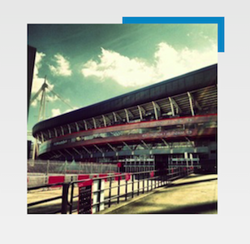  
   
1. HoloCircularProgressBar  
Android4.1 时钟App样式  
项目地址：https://github.com/passsy/android-HoloCircularProgressBar  
APP示例：Android4.1时钟App  
效果图：
  
  
1. ProgressButton  
通过图钉的不同状态显示进度     
项目地址：https://github.com/f2prateek/progressbutton   
文档介绍：http://f2prateek.com/progressbutton/   
效果图：
  

1. GoogleProgressBar  
类似google 多个圆形卡片翻转的progressBar   
项目地址：https://github.com/jpardogo/GoogleProgressBar   
效果图：
  

1. TH-ProgressButton  
带圆形进度显示的按钮   
项目地址；https://github.com/torryharris/TH-ProgressButton    
效果图：
  	
  	
  	
  
  
1. NumberProgressBar  
带数字进度的进度条     
项目地址：https://github.com/daimajia/NumberProgressBar   
效果图：
  

1. CircularProgressDrawable  
带圆形进度显示的进度条  
项目地址：https://github.com/Sefford/CircularProgressDrawable  
效果图：
  
  
1. circular-progress-button   
带进度显示的Button  
项目地址：https://github.com/dmytrodanylyk/circular-progress-button  
效果图：
  

1. MaterialProgressBar  
在4.0系统以上提供统一风格 Material Design 风格的 ProgressBar.  
项目地址：https://github.com/DreaminginCodeZH/MaterialProgressBar  
效果图：

1. FABProgressCircle  
围绕 FloatingActionButton 的圆形进度条效果  
项目地址：https://github.com/JorgeCastilloPrz/FABProgressCircle  
效果图：  

1. ElasticDownload  
一个效果炫酷的下载进度条。  
项目地址：https://github.com/Tibolte/ElasticDownload  
效果图：  

1. spots-dialog  
斑点状的进度指示对话框。  
项目地址：https://github.com/d-max/spots-dialog  
效果图：  
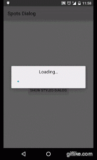

1. CircleProgress  
一个效果很赞的由圆点组成的圆形进度条。  
项目地址：https://github.com/Fichardu/CircleProgress  
效果图：  

1. dashed-circular-progress  
圆形轨迹进度条控件。类小米手环。  
项目地址：https://github.com/glomadrian/dashed-circular-progress  
效果图：  

1. discreteSeekBar  
实现了类似 Material Design 风格的 SeekBar。DiscreteSeekBar 可以在 2.1 以上的应用中使用，可以在 XML 中配置显示的格式，也可以在代码中自定义显示的数字或者指定显示字符。使用方法类似 SeekBar，很简单。    
项目地址：https://github.com/AnderWeb/discreteSeekBar  
效果图：  

1. DownloadProgressBar  
下载进度条效果。
项目地址：https://github.com/panwrona/DownloadProgressBar  
效果图：  

1. SeekBarCompat  
SeekBar 的一个Material Design兼容实现，支持到API 16及以上。
项目地址：https://github.com/ahmedrizwan/SeekBarCompat  
效果图：  

#### 八、TextView  
包括TextView及所有继承自TextView控件，如EditText、Button、RadioButton  

1. android-flowtextview  
文字自动环绕其他View的Layout  
项目地址：https://github.com/deano2390/flowtextview  
效果图：
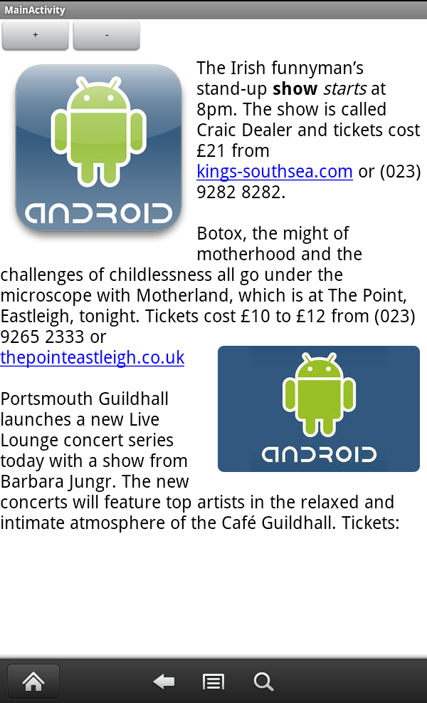
  
1. Android Form EditText  
验证输入合法性的编辑框，支持输入、英文、ip、url等多种正则验证  
项目地址：https://github.com/vekexasia/android-edittext-validator  
Demo地址：https://play.google.com/store/apps/details?id=com.andreabaccega.edittextformexample  

1. Emojicon  
支持emojis的TextView和EditText    
项目地址：https://github.com/rockerhieu/emojicon  
文档地址：http://rockerhieu.com/emojicon/    

1. android-circlebutton  
Android圆形按钮，实际实现是继承自ImageView  
项目地址：https://github.com/markushi/android-circlebutton   
Demo地址：https://github.com/markushi/android-circlebutton/blob/master/example/example.apk    

1. Segmented Radio Buttons for Android  
iOS’s segmented controls的实现  
项目地址：https://github.com/vinc3m1/android-segmentedradiobutton  
Demo地址：https://github.com/thquinn/DraggableGridView/blob/master/bin/DraggableGridViewSample.apk?raw=true  
效果图：
  

1. android-segmented-control  
类似于iOS的SegmentedControl。比上面一个更好用，这个使用颜色来定义，上面只是用图片  
项目地址：https://github.com/hoang8f/android-segmented-control  
效果图：   

1. Chips EditText Library  
支持国家名字联想从而选择显示该国国旗的EditText，实际就是通过SpannableStringBuilder实现  
项目地址：https://github.com/kpbird/chips-edittext-library  
Demo地址：https://github.com/kpbird/chips-edittext-library/tree/master/ChipsEditTextDemo/bin   
效果图：   
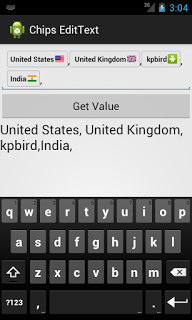

1. AutoFitTextView  
可固定边界内容字体大小自适应的TextView    
项目地址：https://github.com/grantland/android-autofittextview  

1. Shimmer for Android  
文字发淡光的TextView  
项目地址：https://github.com/RomainPiel/Shimmer-android  
效果图：   

1. Titanic   
可以显示水位上升下降(不知道该怎么描述 囧)的TextView    
项目地址：https://github.com/RomainPiel/Titanic    
效果图：
   

1. android-iconify  
提供带Icon的TextView,Menu,Button等  
项目地址：https://github.com/JoanZapata/android-iconify  

1. letterpress   
一个方便你在App中应用自定义字体的库。  
项目地址：https://github.com/Pixplicity/letterpress   
效果图：

1. Calligraphy    
让我们在android开发中使用自定义字体变得更加简单      
项目地址 ：https://github.com/chrisjenx/Calligraphy    
效果图：
  

1. CreditsRoll  
类似星球大战字幕效果的TextView  
项目地址：https://github.com/frakbot/CreditsRoll  
效果图：
  

1. android-process-buton  
带加载或提交进度的Button  
项目地址：https://github.com/dmytrodanylyk/android-process-buton  

1. FButton  
扁平化的Button  
项目地址：https://github.com/hoang8f/android-flat-button  
Demo地址：https://play.google.com/store/apps/details?id=info.hoang8f.fbutton.demo  

1. Android-TextView-LinkBuilder  
一个可以让你给TextView的指定文字添加点击Link的库，支持用户点击的时候可以高亮被点击的文字，支持修改高亮文字的透明度，支持通过正则表达式去匹配要添加Link的文字，支持改变Link文字的颜色等。  
项目地址：https://github.com/klinker24/Android-TextView-LinkBuilder  
效果图：  

1. EdittextWithTag  
可以将输入EditText的内容自动转换为一个Tag效果。  
项目地址：https://github.com/pchauhan/EdittextWithTag  
效果图：  
  

1. GridPasswordView  
仿微信/支付宝的密码输入框效果
项目地址：https://github.com/Jungerr/GridPasswordView  
效果图：  
  

1. material-code-input  
一个 Material 风格的 Code 输入框
项目地址：https://github.com/glomadrian/material-code-input  
效果图：  

1. ParkedTextView  
一个支持占位符的EditText
项目地址：https://github.com/gotokatsuya/ParkedTextView  
效果图：  

#### 九、ScrollView  
1. Discrollview  
支持滚动时Item淡入淡出，平移，缩放效果的ScrollView  
项目地址：https://github.com/flavienlaurent/discrollview   
Demo地址：https://github.com/flavienlaurent/discrollview/raw/master/sample.apk    

1. PullScrollView   
仿照新浪微博Android客户端个人中心的ScrollView，下拉背景伸缩回弹效果。  
项目地址：https://github.com/MarkMjw/PullScrollView    
效果图：
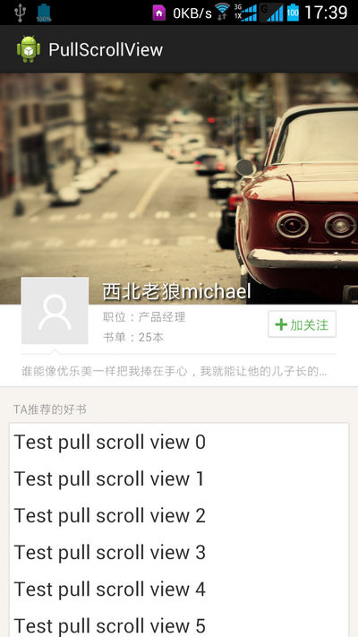  

1. ParallaxScrollView  
支持视差滚动的ScrollView ，背景图片的滚动速度小于ScrollView中子控件的滚动速度    
项目地址：https://github.com/chrisjenx/ParallaxScrollView    
Demo地址：http://cloud.github.com/downloads/chrisjenx/ParallaxScrollView/ParallaxScrollViewDemo-v1.0.5.apk     

1. ObservableScrollView  
滚动时头部视差动画的ScrollView    
项目地址：https://github.com/ksoichiro/Android-ObservableScrollView   
  
  
  
  
  
  

#### 十、TimeView  
包括TimePicker、DatePicker、CalendarView、Clock等时间相关控件  

1. android-times-square  
Android日历时间部件，支持选取单个日期，多个日期，及日期区间段和对话框形式显示  
项目地址：https://github.com/square/android-times-square  
Demo地址：https://github.com/Trinea/TrineaDownload/blob/master/times-square-demo.apk?raw=true  
   
1. android-calendar-card  
日历  
项目地址：https://github.com/kenumir/android-calendar-card  
Demo地址：https://play.google.com/store/apps/details?id=com.wt.calendarcardsample  
效果图：
  
   
1. AndroidWheel  
Android Wheel支持城市、多种日期时间、密码、图片  
项目地址：https://code.google.com/p/android-wheel/  
效果图：
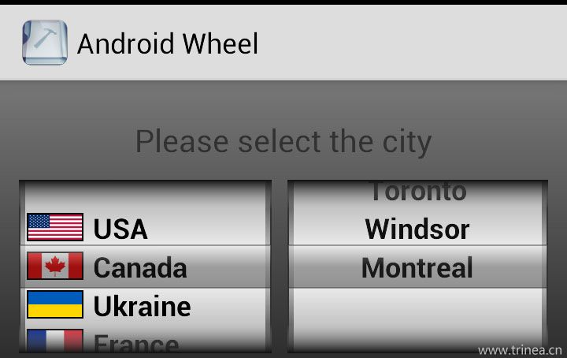  
  
1. GoogleDateTimePickers  
时间选择部件  
项目地址：https://github.com/Mirkoddd/GoogleDateTimePickers  
文档地址：https://play.google.com/store/apps/details?id=com.mirko.sample&hl=it  

1. SublimePicker  
一个Material Design风格的日期、时间选择器  
项目地址：https://github.com/vikramkakkar/SublimePicker  
效果图：
  

1. CircleTimerView  
效果很赞的圆形计时器View.  
项目地址：https://github.com/jiahuanyu/CircleTimerView  
效果图：  

1. DatePicker    
Android日历选择器。  
项目地址：https://github.com/AigeStudio/DatePicker  
效果图：  

#### 十一、TipView  
包括Toast、角标、UndoBar等提示性控件  

1. Crouton  
丰富样式的Toast，允许alert、comfirm、info样式及点击消失样式，允许设置Toast显示时间，允许自定义View。 本文32. SuperToasts为其扩展版  
项目地址：https://github.com/keyboardsurfer/Crouton  
Demo地址：http://play.google.com/store/apps/details?id=de.keyboardsurfer.app.demo.crouton  
   
1. supertooltips  
带动画效果的Tips显示  
项目地址：https://github.com/nhaarman/supertooltips  
Demo地址：https://play.google.com/store/apps/details?id=com.haarman.supertooltips  
   
1. Android ViewBadger  
为其他View添加角标等  
项目地址：https://github.com/jgilfelt/android-viewbadger  
Demo地址：https://github.com/Trinea/TrineaDownload/blob/master/android-viewbadger.apk?raw=true  
效果图：
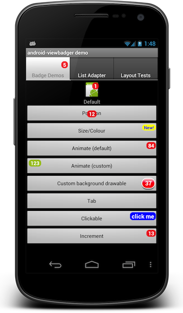  

1. SuperToasts  
更丰富样式的toast，支持Button、Progress、Horizontal Progress样式、支持进入动画、支持撤销及其动画设置    
项目地址：https://github.com/JohnPersano/SuperToasts  
Demo地址：https://play.google.com/store/apps/details?id=com.supertoastsdemo  
效果图：
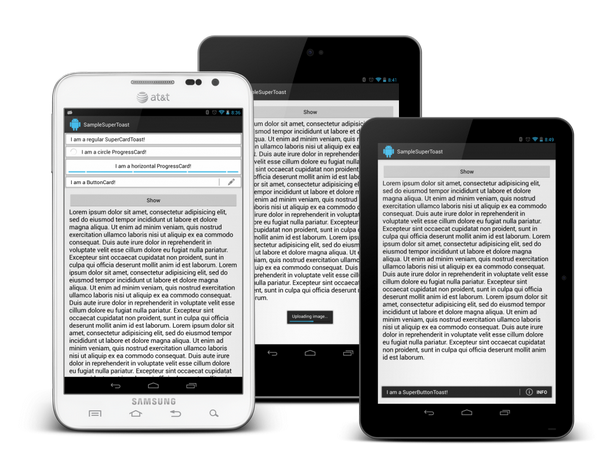  
  
1. UndoBar  
屏幕底部显示取消或是确认的PopupWindows  
项目地址：https://github.com/soarcn/UndoBar  
效果图：
  
   
1. Android-UndoBar  
屏幕底部显示取消或是确认某操作  
项目地址：https://github.com/jenzz/Android-UndoBar  
效果图：
  

#### 十二、FlipView  
1. android-flip  
类似Flipboard翻转动画的实现  
项目地址：https://github.com/openaphid/android-flip  
Demo地址：https://github.com/openaphid/android-flip/blob/master/FlipView/Demo/APK/Aphid-FlipView-Demo.apk?raw=true  
APP示例：flipboard  
   
1. FlipImageView  
支持x、y、z及动画选择的翻转动画的实现  
项目地址：https://github.com/castorflex/FlipImageView  
Demo地址：https://play.google.com/store/apps/details?id=fr.castorflex.android.flipimageview  

1. FoldableLayout  
Flip翻转效果的ListView，目前还不支持ListView缓存  
项目地址：https://github.com/alexvasilkov/FoldableLayout  
Demo地址：http://play.google.com/store/apps/details?id=com.alexvasilkov.foldablelayout.sample  

#### 十三、ColorPickView  
1. ColorPickerView  
颜色选择器，支持PopupWindows或新的Activity中打开  
项目地址：https://code.google.com/p/color-picker-view/  
效果图：
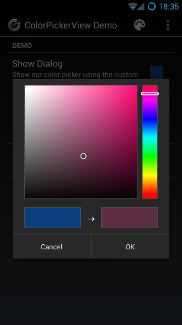  
   
1. HoloColorPicker  
颜色选择器  
项目地址：https://github.com/LarsWerkman/HoloColorPicker  
Demo地址：https://docs.google.com/file/d/0BwclyDTlLrdXRzVnTGJvTlRfU2s/edit  
  
1. ColorPickerPreference  
颜色选择器  
项目地址：https://github.com/attenzione/android-ColorPickerPreference  
效果图：
  

#### 十四、GraphView  
1. achartengine  
强大的图表绘制工具，支持折线图、面积图、散点图、时间图、柱状图、条图、饼图、气泡图、圆环图、范围（高至低）条形图、拨号图/表、立方线图及各种图的结合  
项目地址：https://code.google.com/p/achartengine/  
官方网站：http://www.achartengine.org/  
效果图：
  
  
  
  
  
APP示例：Wordpress Android，Google Analytics  
   
1. GraphView  
绘制图表和曲线图的View，可用于Android上的曲形图、柱状图、波浪图展示  
项目地址：https://github.com/jjoe64/GraphView  
Demo地址：https://play.google.com/store/apps/details?id=com.sothree.umano  
Demo项目：https://github.com/jjoe64/GraphView-Demos  
APP示例：Wordpress Android，Google Analytics  
  
1. HoloGraphLibrary  
绘制现状图、柱状图、饼状图    
项目地址：https://bitbucket.org/danielnadeau/holographlibrary/src  
文档介绍：https://bitbucket.org/danielnadeau/holographlibrary/wiki/Home  

#### 十五、UI Style  
不同样式的系统UI风格，如IOS、Bootstrap风格
   
1. UITableView  
ios风格控件，包括Button、ListView、TableView  
项目地址：https://github.com/thiagolocatelli/android-uitableview  
Demo地址：https://github.com/Trinea/TrineaDownload/blob/master/ui-tableview-demo.apk?raw=true  
   
1. ATableView  
ios风格控件  
项目地址：https://github.com/dmacosta/ATableView  
Demo地址：https://play.google.com/store/apps/details?id=com.nakardo.atableview.demo  
   
1. Cards-UI  
卡片式View，支持单个卡片，item为卡片的ListView  
项目地址：https://github.com/afollestad/Cards-UI  
Demo地址：https://github.com/Trinea/TrineaDownload/blob/master/cards-ui-demo.apk?raw=true  
   
1. cardslib  
卡片式View，支持单个卡片，item为卡片的ListView和GridView  
项目地址：https://github.com/gabrielemariotti/cardslib  
Demo地址：https://play.google.com/store/apps/details?id=it.gmariotti.cardslib.demo  
  
1. Android-Bootstrap  
Bootstrap 风格的按钮    
项目地址： https://github.com/Bearded-Hen/Android-Bootstrap  
效果图：
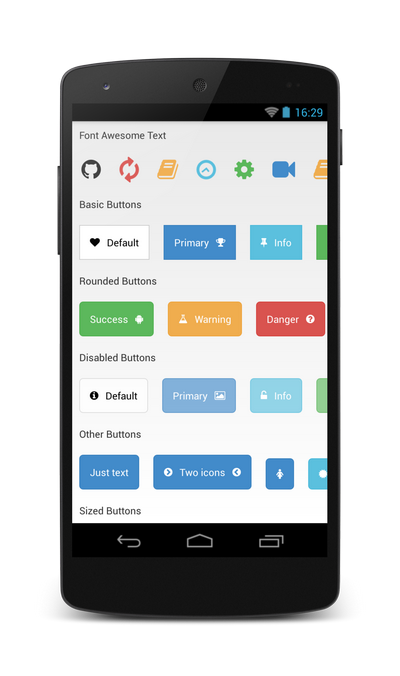   

1. ColorPhrase  
一个可以根据指定分隔符字符串包含的文本格式化为指定颜色的Library.  
项目地址：https://github.com/THEONE10211024/ColorPhrase  
效果图：  
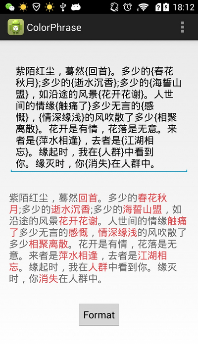

1. MaterialRecents  
像系统的最近使用应用列表那样的堆栈卡片效果。  
项目地址: https://github.com/ZieIony/MaterialRecents  
效果图：  

1. FABtransitions  
Floating Action Button 动画库。  
项目地址: https://github.com/Adirockzz95/FABtransitions  
效果图：  

#### 十六、RecyclerView
1. TreeRecyclerView  
一个使用RecyclerView写的树结构效果。  
项目地址：https://github.com/nuptboyzhb/TreeRecyclerView  
效果图：  

1. sticky-headers-recyclerview  
GroupName滑动到顶端时会固定不动直到另外一个GroupName到达顶端的ListView，采用support-v7中的RecyclerView实现  
项目地址：https://github.com/timehop/sticky-headers-recyclerview  
效果图：  

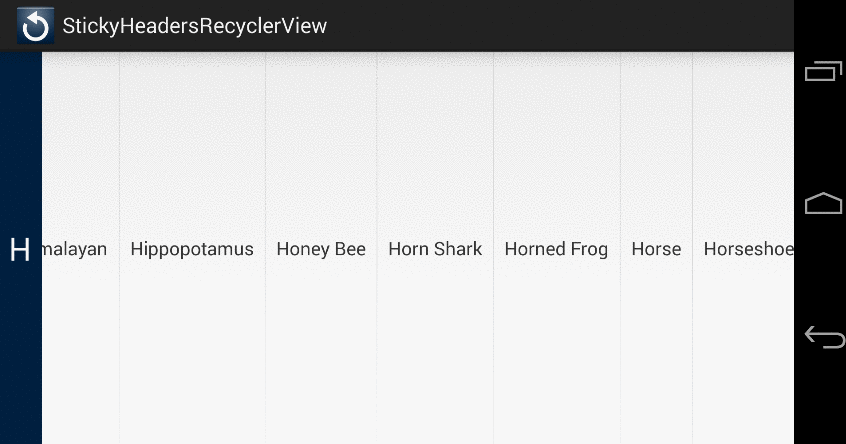

1. RecyclerViewPager  
重写后的 RecyclerViewPager 完全继承自RecyclerView，可以自定义触发翻页的距离，可自定义翻页速度，支持VerticalViewPager，支持Fragment。  
项目地址：https://github.com/lsjwzh/RecyclerViewPager  
效果图：  

1. ExRecyclerView  
扩展的RecyclerView，可以设置头/底部，Item点击/长按监听的recyclerView。可利用ExStaggeredGridLayoutManager给瀑布流设置头/底，利用DividerGridItemDecoration或DividerItemDecoration来添加分割线，可利用OnRecyclerViewScrollListener监听滑动到顶部、底部的事件，还可以监听滑动的距离  
项目地址：https://github.com/tianzhijiexian/ExRecyclerView  
效果图：  

1. RecyclerViewHeader  
轻松为RecyclerView添加头部，调用简单的代码就可以为LinearLayoutManager，GridLayoutManager ，StaggeredGridLayoutManager布局的RecyclerView添加header。  
项目地址：https://github.com/blipinsk/RecyclerViewHeader  
效果图：  

1. RecyclerTabLayout  
一个用 RecyclerView 实现的滑动TabLayout  
项目地址：https://github.com/nshmura/RecyclerTabLayout  
效果图：  

1. Bookends  
可以给 RecyclerView 添加 headers 和 footers 的库。  
项目地址：https://github.com/tumblr/Bookends  

1. UltimateRecyclerView  
一个多功能的RecyclerView，包括了下拉刷新、加载更多，滑动删除，拖拽排序、多种动画、视差拖动、Toolbar渐变、Toolbar和FAB随着滚动出现消失等等效果，都可以放在同一个RecyclerVIew中并自由配置。    
项目地址：https://github.com/cymcsg/UltimateRecyclerView  

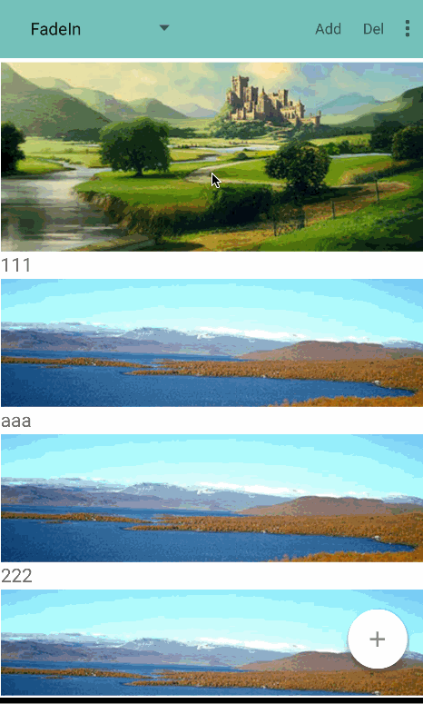
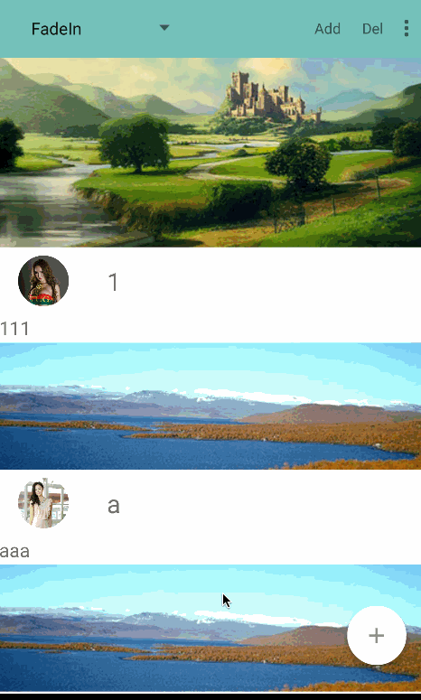
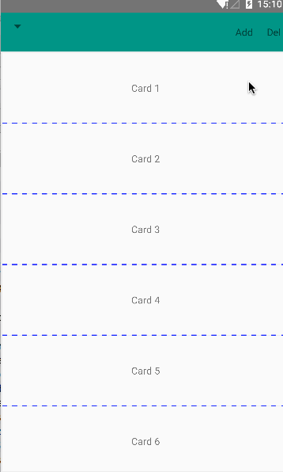

#### 十七、其他
1. SwipeBackLayout  
左右或向上滑动返回的Activity  
项目地址：https://github.com/Issacw0ng/SwipeBackLayout  
Demo地址：https://play.google.com/store/apps/details?id=me.imid.swipebacklayout.demo  
效果图： 
APP示例：知乎  
   
1. ParallaxSwipeBack  
带视觉差的侧滑返回，类似于新版微信和lofter的侧滑返回效果  
项目地址：https://github.com/bushijie/ParallaxSwipeBack   
效果图：  
   
1. android-styled-dialogs  
可自定义样式的dialog，默认与Holo主题样式一致，在Android2.2以上同一样式  
项目地址：https://github.com/inmite/android-styled-dialogs  
Demo地址：https://github.com/Trinea/TrineaDownload/blob/master/styled-dialogs-demo.apk?raw=true  
   
1. NiftyDialogEffects 
款式漂亮的动画dialog
项目地址：https://github.com/sd6352051/NiftyDialogEffects 
Demo地址：
   
1. Android Sliding Up Panel  
可拖动的View，能在当前Activity上扶起一个可拖动的Panel  
项目地址：https://github.com/umano/AndroidSlidingUpPanel  
Demo地址：https://play.google.com/store/apps/details?id=com.sothree.umano  
APP示例：Google Music精简播放栏  
   
1. TableFixHeaders  
第一列固定的Table  
项目地址：https://github.com/InQBarna/TableFixHeaders  
Demo地址：http://bit.ly/13buAIq  
   
1. Inscription  
可用于展示应用change和new feature信息  
项目地址：https://github.com/MartinvanZ/Inscription  
   
1. ActivityTransition  
Activity切换动画，包括渐变、flip、某个位置进入等等  
项目地址：https://github.com/ophilbert/ActivityTransition  
使用介绍：https://github.com/jfeinstein10/JazzyViewPager/blob/master/JazzyViewPager.apk?raw=true  
效果图：类似桌面左右切换的各种效果，不过桌面并非用ViewPager实现而已  
   
1. GlowPadBackport  
将Android4.2的锁屏界面解锁扩展到Android1.6及1.6+  
项目地址：https://github.com/rock3r/GlowPadBackport  
Demo地址：https://play.google.com/store/apps/details?id=net.sebastianopoggi.samples.ui.GlowPadSample  
效果图：
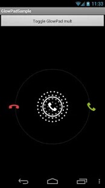  

1. GlowPadView  
Android4锁屏界面解锁  
项目地址：https://github.com/nadavfima/GlowPadView  
效果图：
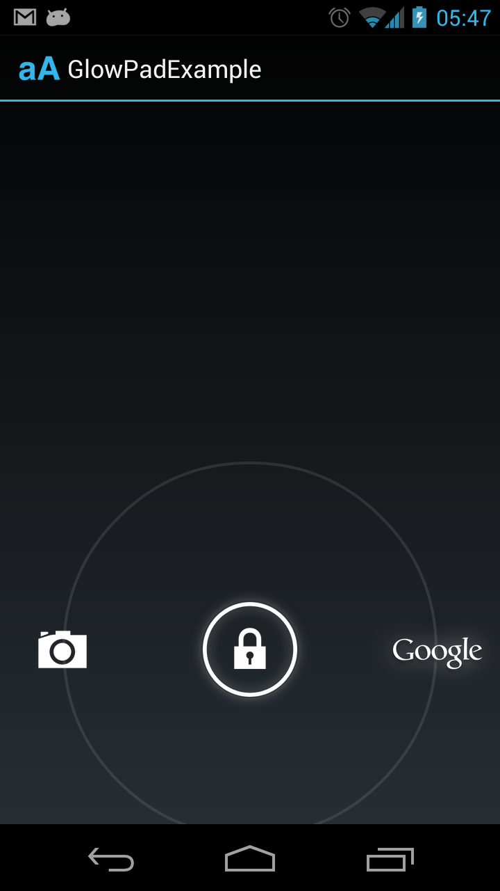  
   
1. android-lockpattern  
Android的图案密码解锁  
项目地址：https://github.com/haibison/android-lockpattern  
Demo地址：https://play.google.com/store/apps/details?id=group.pals.android.lib.ui.lockpattern.demo  
使用介绍：https://code.google.com/p/android-lockpattern/wiki/QuickUse  
APP示例：Android开机的图案密码解锁，支付宝的密码解锁  
  
1. RangeBar  
类似于SeekBar，不同的是可以选择一个范围内的值而不是单个值  
项目地址：https://github.com/edmodo/range-bar  
Demo地址：https://github.com/Trinea/TrineaDownload/blob/master/range-bar-demo.apk?raw=true  
效果图: 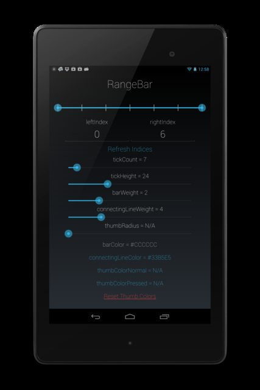  

1. ChromeView  
利用Chromium实现的WebView，解决各个Android版本WebView不同的问题，同时利用最新Chrome代码    
项目地址：https://github.com/pwnall/chromeview  
   
1. Android Slider Preference Library  
可添加到设置中的基于对话框的RankBar小部件  
项目地址：https://github.com/jayschwa/AndroidSliderPreference   

1. ShowcaseView library  
用于高亮显示应用程序的特定部分，从而突出突出重点  
项目地址：https://github.com/amlcurran/ShowcaseView   

1. android-segmented-control  
Android上的Segmented Controls，相当于RadioButton组  
项目地址：https://github.com/hoang8f/android-segmented-control   

1. Swipeable Cards  
类似Tinder的卡片效果，可以加载图片并动画效果展示，向左滑动表示喜欢，向右表示不喜欢  
项目地址：https://github.com/kikoso/Swipeable-Cards  
Demo地址：https://play.google.com/store/apps/details?id=info.hoang8f.fbutton.demo  

1. EdgeEffectOverride  
改变ScrollView, ListView, ExpandableListView, GridView, ViewPager等滚动控件滚动到边缘的颜色效果  
项目地址：https://github.com/AndroidAlliance/EdgeEffectOverride  

1. Leonids  
一个非常轻量的粒子效果系统库。  
项目地址： https://github.com/plattysoft/Leonids  
效果图：  

1. FlowLayout  
一个简单的流式布局，用法类似 LinearLayout，但是能够让子元素根据宽度自动换行  
项目地址：[FLowLayout](https://github.com/LyndonChin/AndroidFlowLayout)  
效果图：  
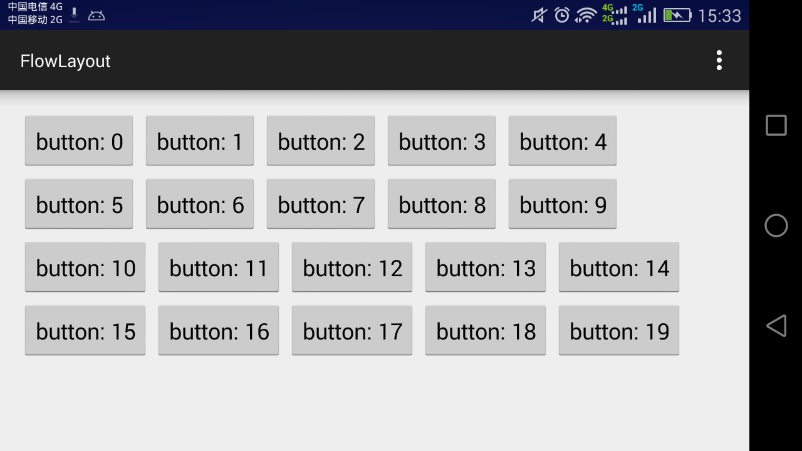

1. Android-ScalableVideoView  
拥有像ImageView那样的多种缩放类型的VideoView。  
项目地址：https://github.com/yqritc/Android-ScalableVideoView  
效果图：  

1. RearrangeableLayout  
一个可以通过拖动重新排列内部子View的布局。
项目地址：https://github.com/rajasharan/RearrangeableLayout
效果图：
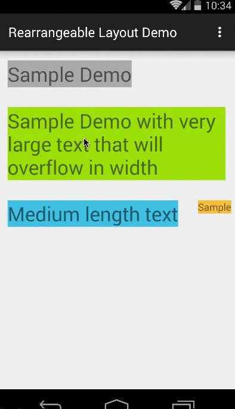

1. Android-StepsView  
Step By Step的进度指示View，可以定义进度的颜色。  
项目地址：https://github.com/anton46/Android-StepsView    
效果图：  

1. material-animated-switch  
一个material Switch 控件支持ico动画和颜色变换。  
项目地址：https://github.com/glomadrian/material-animated-switch  
效果图：  

1. CreditCardView  
自定义信用卡View。  
项目地址：https://github.com/vinaygaba/CreditCardView  
效果图：  

1. ProductTour  
Google Drive的视差滚动引导页效果实现.  
项目地址：https://github.com/matrixxun/ProductTour  
效果图：  

1. velocimeter-view  
一个速度指示盘效果的自定义View.  
项目地址：https://github.com/glomadrian/velocimeter-view  
效果图：  

1. bottomsheet  
Android component which presents a dismissible view from the bottom of the screen.  
项目地址：https://github.com/Flipboard/bottomsheet  
效果图：  

1. WheelIndicatorView   
模仿 Google Fit 的活动指示进度效果.  
项目地址：https://github.com/dlazaro66/WheelIndicatorView  
效果图：  

1. ParallaxSplash  
视差动画的引导页.  
项目地址：https://github.com/leerduo/ParallaxSplash  
效果图：  

1. AnimateCheckBox  
自定义CheckBox，选中未选中的切换动画很赞。  
项目地址：https://github.com/hanks-zyh/AnimateCheckBox  
效果图：  

1. GiftCard-Android  
很赞的动画交互效果。  
项目地址：https://github.com/MartinRGB/GiftCard-Android  
效果图：  

1. MaterialSpinner  
一个Material Design风格的Spinner，最低支持到2.3系统。  
项目地址：https://github.com/ganfra/MaterialSpinner  
效果图：  

1. AndroidTagGroup  
Android 的Tag Group的库。  
项目地址：https://github.com/2dxgujun/AndroidTagGroup  
效果图：  
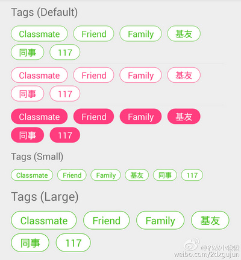

1. FileBrowserView  
一个Android文件选择的库。实现从SD卡逐级目录选择文件，可以作为APP的一个类库  
项目地址：https://github.com/psaravan/FileBrowserView  
效果图：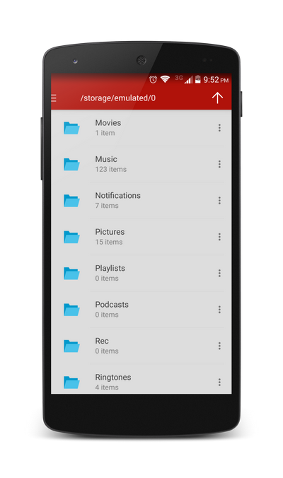

1. Android-PullLayout  
仿UC天气下拉和微信下拉眼睛  
项目地址：https://github.com/BlueMor/Android-PullLayout  
效果图：  

1. labelview  
贴纸效果。  
项目地址：https://github.com/linger1216/labelview  
效果图：  

1. DrawableView  
支持手写绘画的自定View，并且可以将绘画的结果保存为图片。  
项目地址：https://github.com/PaNaVTEC/DrawableView  
效果图：  

1. TourGuide
一个可以让你很方便的给App添加操作提示导航的库。    
项目地址：https://github.com/worker8/TourGuide  
效果图：  

1. MultipleTheme  
Android换肤／夜间模式的Android框架，配合theme和换肤控件框架可以做到无缝切换换肤（无需重启应用和当前页面）。  
项目地址：https://github.com/dersoncheng/MultipleTheme  

1. MusicPlayerView  
漂亮的自定义圆形音乐播放进度条  
项目地址：https://github.com/iammert/MusicPlayerView  
效果图:  

1. CustomActivityOnCrash  
一个在你的App崩溃的时候可以显示一个自定义Activity的库。  
项目地址：https://github.com/Ereza/CustomActivityOnCrash  

1. EaseInterpolator  
三十种动画插值器  
项目地址：https://github.com/cimi-chen/EaseInterpolator  
效果图:  

1. LandscapeVideoCamera  
强大的自定义 Android Camera，并且支持细粒度的控制视频质量和文件大小  
项目地址：https://github.com/JeroenMols/LandscapeVideoCamera  
