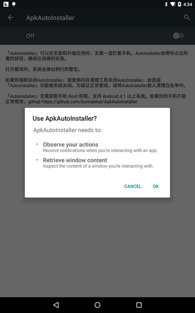
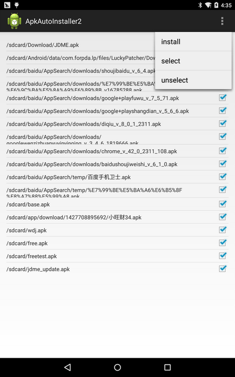
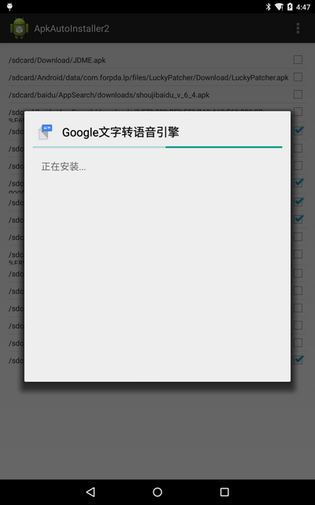

## 第二部分 工具库  
主要包括那些不错的开发库，包括依赖注入框架、图片缓存、网络相关、数据库ORM建模、Android公共库、Android 高版本向低版本兼容、多媒体相关及其他。  
#### 一、依赖注入DI  
通过依赖注入减少View、服务、资源简化初始化，事件绑定等重复繁琐工作  

1. AndroidAnnotations(Code Diet)  
android快速开发框架  
项目地址：https://github.com/excilys/androidannotations  
文档介绍：https://github.com/excilys/androidannotations/wiki  
官方网站：http://androidannotations.org/  
特点：(1) 依赖注入：包括view，extras，系统服务，资源等等  
(2) 简单的线程模型，通过annotation表示方法运行在ui线程还是后台线程  
(3) 事件绑定：通过annotation表示view的响应事件，不用在写内部类  
(4) REST客户端：定义客户端接口，自动生成REST请求的实现  
(5) 没有你想象的复杂：AndroidAnnotations只是在在编译时生成相应子类  
(6) 不影响应用性能：仅50kb，在编译时完成，不会对运行时有性能影响。  
PS：与roboguice的比较：roboguice通过运行时读取annotations进行反射，所以可能影响应用性能，而AndroidAnnotations在编译时生成子类，所以对性能没有影响  
   
1. roboguice  
帮你处理了很多代码异常，利用annotation使得更少的代码完成项目  
项目地址：https://github.com/roboguice/roboguice  
文档介绍：https://github.com/roboguice/roboguice/wiki  
   
1. butterknife  
利用annotation帮你快速完成View的初始化，减少代码  
项目地址：https://github.com/JakeWharton/butterknife  
文档介绍：http://jakewharton.github.io/butterknife/  
   
1. Dagger  
依赖注入，适用于Android和Java  
项目地址：https://github.com/square/dagger  
文档介绍：http://square.github.io/dagger/  

1. Dexposed  
阿里巴巴无线事业部的第一个重量级Android开源项目——无侵入的运行期AOP框架『Dexposed』，基于ROOT社区著名开源项目Xposed改造剥离了ROOT部分，演化为服务于所在应用自身的AOP框架。它支撑了阿里大部分App的在线分钟级客户端bugfix和线上调试能力。  
项目地址：https://github.com/alibaba/dexposed   

1. barber  
通过注解获取定义控件属性值的库  
项目地址：https://github.com/hzsweers/barber   

1. DeepLinkDispatch  
一个简单的、基于注解的Deep Link处理库  
项目地址：https://github.com/airbnb/DeepLinkDispatch   

#### 二、图片缓存  
1. Android-Universal-Image-Loader  
图片缓存，目前使用最广泛的图片缓存，支持主流图片缓存的绝大多数特性。  
项目地址：https://github.com/nostra13/Android-Universal-Image-Loader  
Demo地址：https://github.com/Trinea/TrineaDownload/blob/master/universal-imageloader-demo.apk?raw=true  
文档介绍：http://www.intexsoft.com/blog/item/74-universal-image-loader-part-3.html  
   
1. picasso  
square开源的图片缓存  
项目地址：https://github.com/square/picasso  
文档介绍：http://square.github.io/picasso/  
特点：(1)可以自动检测adapter的重用并取消之前的下载  
(2)图片变换  
(3)可以加载本地资源  
(4)可以设置占位资源  
(5)支持debug模式  
   
1. ImageCache  
图片缓存，包含内存和Sdcard缓存  
项目地址：https://github.com/Trinea/AndroidCommon  
Demo地址：https://play.google.com/store/apps/details?id=cn.trinea.android.demo  
文档介绍：http://www.trinea.cn/android/android-imagecache/  
特点：(1)支持预取新图片，支持等待队列  
(2)包含二级缓存，可自定义文件名保存规则  
(3)可选择多种缓存算法(FIFO、LIFO、LRU、MRU、LFU、MFU等13种)或自定义缓存算法  
(4)可方便的保存及初始化恢复数据  
(5)支持不同类型网络处理  
(6)可根据系统配置初始化缓存等  

#### 三、网络相关  
1. Asynchronous Http Client for Android  
Android异步Http请求  
项目地址：https://github.com/loopj/android-async-http  
文档介绍：http://loopj.com/android-async-http/  
特点：(1) 在匿名回调中处理请求结果  
(2) 在UI线程外进行http请求  
(3) 文件断点上传  
(4) 智能重试  
(5) 默认gzip压缩  
(6) 支持解析成Json格式  
(7) 可将Cookies持久化到SharedPreferences  
   
1. android-query  
异步加载，更少代码完成Android加载  
项目地址：https://github.com/androidquery/androidquery 或 https://code.google.com/p/android-query/  
文档介绍：https://code.google.com/p/android-query/#Why_AQuery?  
Demo地址：https://play.google.com/store/apps/details?id=com.androidquery  
特点：https://code.google.com/p/android-query/#Why_AQuery?  
   
1. Async Http Client  
Java异步Http请求  
项目地址：https://github.com/AsyncHttpClient/async-http-client  
文档介绍：http://sonatype.github.io/async-http-client/  
   
1. Ion  
支持图片、json、http post等异步请求  
项目地址：https://github.com/koush/ion  
文档介绍：https://github.com/koush/ion#more-examples  
   
1. HttpCache  
Http缓存  
项目地址：https://github.com/Trinea/AndroidCommon  
Demo地址：https://play.google.com/store/apps/details?id=cn.trinea.android.demo  
文档介绍：http://www.trinea.cn/android/android-http-cache  
特点是：(1) 根据cache-control、expires缓存http请求  
(2) 支持同步、异步Http请求  
(3) 在匿名回调中处理请求结果  
(4) 在UI线程外进行http请求  
(5) 默认gzip压缩  
   
1. Http Request  
项目地址：https://github.com/kevinsawicki/http-request  
文档介绍：https://github.com/kevinsawicki/http-request#examples  
   
1. okhttp  
square开源的http工具类  
项目地址：https://github.com/square/okhttp  
文档介绍：http://square.github.io/okhttp/  
特点：(1) 支持SPDY( http://zh.wikipedia.org/wiki/SPDY )协议。SPDY协议是Google开发的基于传输控制协议的应用层协议，通过压缩，多路复用(一个TCP链接传送网页和图片等资源)和优先级来缩短加载时间。  
(2) 如果SPDY不可用，利用连接池减少请求延迟  
(3) Gzip压缩  
(4) Response缓存减少不必要的请求  
   
1. Retrofit  
RESTFUL API设计  
项目地址：https://github.com/square/retrofit  
文档介绍：http://square.github.io/retrofit/  
   
1. RoboSpice  
Android异步网络请求工具，支持缓存、REST等等  
项目地址：https://github.com/stephanenicolas/robospice  
Demo地址：https://github.com/stephanenicolas/RoboDemo/downloads  
  

#### 四、数据库 orm工具包  
orm的db工具类，简化建表、查询、更新、插入、事务、索引的操作  

1. greenDAO  
Android Sqlite orm的db工具类  
项目地址：https://github.com/greenrobot/greenDAO  
文档介绍：http://greendao-orm.com/documentation/  
官方网站：http://greendao-orm.com/  
特点：(1) 性能佳  
(2) 简单易用的API  
(3) 内存小好小  
(4) 库大小小  
   
1. ActiveAndroid  
Android Sqlite orm的db工具类  
项目地址：https://github.com/pardom/ActiveAndroid  
文档介绍：https://github.com/pardom/ActiveAndroid/wiki/_pages  
   
1. Sprinkles  
Android Sqlite orm的db工具类  
项目地址：https://github.com/emilsjolander/sprinkles  
文档介绍：http://emilsjolander.github.io/blog/2013/12/18/android-with-sprinkles/  
特点：比较显著的特点就是配合https://github.com/square/retrofit 能保存从服务器获取的数据  
   
1. ormlite-android  
项目地址：https://github.com/j256/ormlite-android  
文档介绍：http://ormlite.com/sqlite_java_android_orm.shtml   
   
1. Schematic  
根据SQLite生成ContentProvider    
项目地址：https://github.com/SimonVT/schematic   
  

#### 五、Android公共库  
1. Guava  
Google的基于java1.6的类库集合的扩展项目，包括collections, caching, primitives support, concurrency libraries, common annotations, string processing, I/O等等. 这些高质量的API可以使你的JAVa代码更加优雅，更加简洁  
项目地址：https://code.google.com/p/guava-libraries/  
文档介绍：https://code.google.com/p/guava-libraries/wiki/GuavaExplained  
   
1. Volley  
Google提供的网络通信库，使得网络请求更简单、更快速  
项目地址：https://android.googlesource.com/platform/frameworks/volley  
Github地址：https://github.com/mcxiaoke/android-volley    
文档地址：http://commondatastorage.googleapis.com/io-2013/presentations/110%20-%20Volley-%20Easy,%20Fast%20Networking%20for%20Android.pdf  

1. AndroidCommon  
Android公共库  
项目地址：https://github.com/Trinea/AndroidCommon  
Demo地址：https://play.google.com/store/apps/details?id=cn.trinea.android.demo  
文档介绍：http://www.trinea.cn/android/android-common-lib/  
包括：(1)缓存(图片缓存、预取缓存、网络缓存)  
(2) 公共View(下拉及底部加载更多ListView、底部加载更多ScrollView、滑动一页Gallery)  
(3) Android常用工具类(网络、下载、Android资源操作、shell、文件、Json、随机数、Collection等等)  
   
1. shipfaster  
整合了Dagger Otto Retrofit Robolectric Picasso OkHttp，方便快速开发  
项目地址：https://github.com/pyricau/shipfaster  
   
1. CleanAndroidCode  
整合了Dagger Otto AndroidAnnotations，方便快速开发  
项目地址：https://github.com/pyricau/CleanAndroidCode  
   
1. xUtils  
基于Afinal，包含DbUtils、ViewUtils、HttpUtils、BitmapUtils四大模块，可用于快速开发  
项目地址：https://github.com/wyouflf/xUtils    
   
1. Afinal  
Afinal是一个android的ioc，orm框架，内置了四大模块功能：FinalAcitivity,FinalBitmap,FinalDb,FinalHttp。通过finalActivity，我们可以通过注解的方式进行绑定ui和事件。通过finalBitmap，我们可以方便的加载bitmap图片，而无需考虑oom等问题。通过finalDB模块，我们一行代码就可以对android的sqlite数据库进行增删改查。通过FinalHttp模块，我们可以以ajax形式请求http数据  
项目地址：https://github.com/yangfuhai/afinal  
官方网站：http://www.afinal.org  

1. VolleyPlus  
Volley的加强版，在Volley的基础上进行了扩展增加了：GsonRequest、GZipRequest、MultiPartRequest、SimpleMultiPartRequest、DownloadRequest、ImageRequest等Request的实现，以及增加了一个高效的图片缓存工具类SimpleImageLoder，同时支持多种类型的缓存：Network Caching、Resource Caching、File Caching、Video Caching和Content URI Caching。
项目地址：https://github.com/DWorkS/VolleyPlus  

1. ApkAutoInstaller  
Android apk自动安装sdk 基于AccessibilityService  
项目地址：https://github.com/bunnyblue/ApkAutoInstaller  
效果图：

#### 六、Android 高版本向低版本兼容  
1. ActionBarSherlock  
为Android所有版本提供统一的ActionBar，解决4.0以下ActionBar的适配问题  
项目地址：https://github.com/JakeWharton/ActionBarSherlock  
Demo地址：https://play.google.com/store/apps/details?id=com.actionbarsherlock.sample.demos  
APP示例：太多了。。现在连google都在用  
   
1. Nine Old Androids  
将Android 3.0(Honeycomb)所有动画API(ObjectAnimator ValueAnimator等)兼容到Android1.0  
项目地址：https://github.com/JakeWharton/NineOldAndroids  
Demo地址：https://play.google.com/store/apps/details?id=com.jakewharton.nineoldandroids.sample  
文档介绍：http://nineoldandroids.com/  
   
1. HoloEverywhere  
将Android 3.0的Holo主题兼容到Android2.1++  
项目地址：https://github.com/Prototik/HoloEverywhere  
Demo地址：https://raw.github.com/Prototik/HoloEverywhere/repo/org/holoeverywhere/demo/2.1.0/demo-2.1.0.apk  
文档介绍：http://android-developers.blogspot.com/2012/01/holo-everywhere.html  
   
1. SherlockNavigationDrawer  
将Android NavigationDrawer和ActionbarSherlock结合，解决4.0以下NavigationDrawer的适配问题  
项目地址：https://github.com/tobykurien/SherlockNavigationDrawer  
文档地址：http://developer.android.com/training/implementing-navigation/nav-drawer.html  

1. Notifications4EveryWhere  
将Android 4.1的Notification兼容到Android2.2++  
项目地址：https://github.com/youxiachai/Notifications4EveryWhere  
  
1. Android Switch Widget Backport  
将Android Switch和SwitchPreference的兼容到Android2.1++  
项目地址：https://github.com/BoD/android-switch-backport  
Demo地址：https://play.google.com/store/apps/details?id=org.jraf.android.backport.switchwidget.sample  
文档介绍：https://github.com/BoD/android-switch-backport#using-the-switch  

1. android-datepicker  
将Android 4.0的datepicker兼容到Android2.2++  
项目地址：https://github.com/SimonVT/android-datepicker  

1. GlowPadBackport  
Android 4.2的GlowPadView向后适配到API4以上  
项目地址：https://github.com/frakbot/GlowPadBackport 

1. vector-compat  
VectorDrawable 和 AnimatedVectorDrawable 的兼容库，支持4.0以上系统  
项目地址：https://github.com/wnafee/vector-compat  
效果图：  

#### 七、多媒体相关  
1. cocos2d-x  
跨平台的2d游戏框架，支持Android、IOS、Linux、Windows等众多平台  
项目地址：https://github.com/cocos2d/cocos2d-x  
文档介绍：http://www.cocos2d-x.org/wiki  
官方网站：http://www.cocos2d-x.org/  
   
1. Vitamio  
是一款Android与iOS平台上的全能多媒体开发框架  
项目地址：https://github.com/yixia/VitamioBundle  
网站介绍：http://www.vitamio.org/docs/  
特点：(1) 全面支持硬件解码与GPU渲染  
(2) 能够流畅播放720P甚至1080P高清MKV，FLV，MP4，MOV，TS，RMVB等常见格式的视频  
(3) 在Android与iOS上跨平台支持 MMS, RTSP, RTMP, HLS(m3u8)等常见的多种视频流媒体协议，包括点播与直播。  
   
1. PhotoProcessing  
利用ndk处理图片库，支持Instafix、Ansel、Testino、XPro、Retro、BW、Sepia、Cyano、Georgia、Sahara、HDR、Rotate(旋转)、Flip(翻转)等各种特效  
项目地址：https://github.com/lightbox/PhotoProcessing  
Demo地址：https://github.com/Trinea/TrineaDownload/blob/master/photo-processing.apk?raw=true  
   
1. Android StackBlur  
图片模糊效果工具类  
项目地址：https://github.com/kikoso/android-stackblur  
Demo地址：https://github.com/kikoso/android-stackblur/blob/master/StackBlurDemo/bin/StackBlurDemo.apk?raw=true  
文档介绍：https://github.com/kikoso/android-stackblur#usage  

1. Bitmap Smart Clipping using OpenCV  
图片智能裁剪保留重要部分显示   
项目地址：https://github.com/beartung/tclip-android  
利用淘宝的 http://code.taobao.org/p/tclip/ 库完成  
一淘玩客正在使用的图片裁剪，自动识别图片中的重要区域，并且在图片裁剪时保留重要区域  
特点：(1). 能进行人脸识别。图片中有人脸，将自动视为人脸区域为重要区域，将不会被裁剪掉  
(2).自动其它重要区域。如果图片中未识别出人脸，则会根据特征分布计算出重区域  
   
1. Cropper  
图片局部剪切工具，可触摸控制选择区域或旋转  
项目地址：https://github.com/edmodo/cropper  
使用介绍：https://github.com/edmodo/cropper/wiki  
效果图：
  

1. android-crop  
图片裁剪Activity  
项目地址：https://github.com/jdamcd/android-crop  
效果图：
  

1. TileView  
可分块显示大图，支持2D拖动、双击、双指放大、双指捏合  
项目地址：https://github.com/moagrius/TileView  
Demo地址：http://moagrius.github.io/TileView/TileViewDemo.apk  

1. BlurEffectForAndroidDesign  
图片模糊效果  
项目地址：https://github.com/PomepuyN/BlurEffectForAndroidDesign  

1. android-eye  
PC端网页查看同一局域网内的手机摄像头内容，可以用来监控哦  
项目地址：https://github.com/Teaonly/android-eye  
Demo地址：https://play.google.com/store/apps/details?id=teaonly.droideye  

1. libpng for Android  
PNG图片的jni库，支持几乎png的所有特性  
项目地址：https://github.com/julienr/libpng-android  
文档地址：http://www.libpng.org/pub/png/libpng.html  

1. android-gpuimage    
基于GPU的图片滤镜    
项目地址：https://github.com/CyberAgent/android-gpuimage     

1. AndroidFaceCropper  
图片脸部自动识别，将识别后的局部图片返回  
项目地址：https://github.com/lafosca/AndroidFaceCropper  

1. Android Video Crop  
利用TextureView播放和剪切视频，类似ImageView.setScaleType  
项目地址：https://github.com/dmytrodanylyk/android-video-crop  
Demo地址：https://github.com/lafosca/AndroidFaceCropper/releases/download/1.0/FaceCropper-sample-debug-unaligned.apk  
  
1. svg-android  
Android Svg矢量图形支持  
项目地址：https://github.com/japgolly/svg-android https://github.com/japgolly/svg-android  

1. Android Visualizer  
从Android MediaPlayer获得音频，然后像iTunes及WinAmp一样展示音轨  
项目地址：https://github.com/felixpalmer/android-visualizer  

1. voice-recording-visualizer  
一个可以将麦克风的音频可视化的库。  
项目地址：https://github.com/tyorikan/voice-recording-visualizer  
效果图：  

1. DanmakuFlameMaster  
android上开源弹幕解析绘制引擎项目  
项目地址：https://github.com/ctiao/DanmakuFlameMaster  
BiliBili地址：https://github.com/Bilibili/DanmakuFlameMaster

#### 八、事件总线(订阅者模式)  
通过发布/订阅事件解耦事件发送和接受，从而简化应用程序组件(Activities, Fragments及后台线程)之间的通信  

1. EventBus  
greenrobot的开源项目  
项目地址：https://github.com/greenrobot/EventBus  
文档介绍：https://github.com/greenrobot/EventBus#general-usage-and-api  
特点：(1) 支持在不同类型的线程中处理订阅，包括发布所在线程，UI线程、单一后台线程、异步线程  
(2) 支持事件优先级定义，支持优先级高的订阅者取消事件继续传递，支持粘性事件，是不是跟系统的有序广播、粘性广播很像啊  
(3) 不是基于annotations  
(4) 性能更优  
(5) 体积小  
(6) 支持单例创建或创建多个对象  
(7) 支持根据事件类型订阅  

1. Otto  
Square的开源项目，基于Guava的Android优化  
项目地址：https://github.com/square/otto  
文档介绍：http://square.github.io/otto/  
[EventBus与Otto的功能及性能对比文档](https://github.com/greenrobot/EventBus#comparison-with-squares-otto)  
[EventBus与Otto性能对比Demo Apk](https://play.google.com/store/apps/details?id=de.greenrobot.eventperf)  

#### 九、传感器  
1. Great Android Sensing Toolkit  
Android感应器工具包，包含示例及使用过程中可能需要的算法  
项目地址：https://github.com/gast-lib/gast-lib  
Demo地址：https://play.google.com/store/apps/details?id=root.gast.playground  
文档介绍：https://github.com/gast-lib/gast-lib#documentation  

1. SensorManager  
Android传感器管理  
项目地址：https://github.com/nlathia/SensorManager  
文档介绍：https://docs.google.com/document/d/1TqThJULb-4e6TGb1gdkAaPCfyuXStjJpbnt7a0OZ9OE/edit  

1. GPSLogger  
记录GPS信息  
项目地址：https://github.com/mendhak/gpslogger  
Demo地址：https://play.google.com/store/apps/details?id=com.mendhak.gpslogger  
文档介绍：http://code.mendhak.com/gpslogger/  

1. Pedometer  
计步器，使用硬件计步感应器  
项目地址：https://github.com/j4velin/Pedometer  

1. leapcast  
ChromeCast模拟器的App  
项目地址：https://github.com/dz0ny/leapcast  

1. Arduino-Communicator  
与Arduino通信的App  
项目地址：https://github.com/jeppsson/Arduino-Communicator  

1. android-pedometer  
Android计步器  
项目地址：https://github.com/bagilevi/android-pedometer  
Demo地址：http://pedometer.googlecode.com/files/Pedometer-1.4.apk  

1. OwnTracks for Android  
自己的轨迹记录  
项目地址：https://github.com/owntracks/android  

1. Shake Detector library for Android   
Android手机震动摇晃检测库，提供供UI线程调用的回调接口  
项目地址：https://github.com/tbouron/ShakeDetector  
Demo地址：https://play.google.com/store/apps/details?id=com.github.tbouron.shakedetector.example  

1. Android heart rate monitor   
Android心跳检测  
项目地址：https://github.com/phishman3579/android-heart-rate-monitor  

1. Bluetooth LE Library for Android   
蓝牙源信息，包括宝库Mac、更新时间、RSSI、UUID、信号源距离、影响范围等信息  
项目地址：https://github.com/alt236/Bluetooth-LE-Library---Android  
Demo地址：https://play.google.com/store/apps/details?id=uk.co.alt236.btlescan  

1. farebot   
通过NFC 从公交卡中读取数据的一个应用   
项目地址：https://github.com/codebutler/farebot     

#### 十、安全  
1. SQLCipher  
Sqlite加密工具  
项目地址：https://github.com/sqlcipher/sqlcipher  
帮助文档：http://sqlcipher.net/sqlcipher-for-android/  

1. Conceal  
快速高效的进行文件加密解密  
项目地址：https://github.com/facebook/conceal  
文档介绍：https://github.com/facebook/conceal#usage  

1. secure-preferences
安全的 SharedPreferences，可以将要存储在 SharedPreferences 的内容进行加密，而加密用的key 会通过库里自定义的 KeyGenerator 生成并存储在 Android Keystore System 中。
项目地址：https://github.com/ophio/secure-preferences

1. Android-PasscodeLock  
应用锁，每次启动或从任何Activity启动应用都需要输入四位数字的密码方可进入  
项目地址：https://github.com/wordpress-mobile/Android-PasscodeLock  
Demo地址：https://play.google.com/store/apps/details?id=com.sothree.umano  
APP示例：Wordpress Android，支付宝，挖财  
   
1. android-lockpattern  
Android的图案密码解锁  
项目地址：https://code.google.com/p/android-lockpattern/  
Demo地址：https://play.google.com/store/apps/details?id=group.pals.android.lib.ui.lockpattern.demo  
使用介绍：https://code.google.com/p/android-lockpattern/wiki/QuickUse  
示例APP：Android开机的图案密码解锁，支付宝的密码解锁  

#### 十一、插件化  
1. dynamic-load-apk  
Android动态加载Apk，热部署。支持一定程度不安装升级  
项目地址：https://github.com/singwhatiwanna/dynamic-load-apk  
文档介绍：http://blog.csdn.net/singwhatiwanna/article/details/22597587  

1. xCombine  
Android App插件式插件开发，插件必须先安装  
项目地址：https://github.com/wyouflf/xCombine  
文档介绍：http://my.oschina.net/u/1171837/blog/155377  

1. Android Plugin Framework  
Android插件式开发，开放的源码目前不完整  
项目地址：https://github.com/umeng/apf    

#### 十二、文件  
对不同文档类型的处理，包括PDF、Word、EPub、Html、Zip等

1. purePDF  
允许从任何运行的SWF文件读取和创建PDF文档  
项目地址：https://github.com/sephiroth74/purePDF  
  
1. Office 365 SDK for Android Preview  
可支持Microsoft SharePoint Lists, Microsoft SharePoint Files, Microsoft Exchange Calendar, Microsoft Exchange Contacts, Microsoft Exchange Mail  
项目地址：https://github.com/OfficeDev/Office-365-SDK-for-Android  

1. OpenSpritz-Android  
EPub阅读器  
项目地址：https://github.com/OnlyInAmerica/OpenSpritz-Android  
  
1. jsoup  
一个解析html的java库，可方便的提取和操作数据  
项目地址：https://github.com/jhy/jsoup  
官方网站：http://jsoup.org/  
作用：(1) 从一个url、文件或string获得html并解析  
(2) 利用dom遍历或css选择器查找、提取数据  
(3) 操作html元素  
(4) 根据白名单去除用于提交的非法数据防止xss攻击  
(5) 输出整齐的html  
   
1. ZIP  
java压缩和解压库  
项目地址：https://github.com/zeroturnaround/zt-zip  
文档介绍：https://github.com/zeroturnaround/zt-zip#examples  
作用：(1) 解压和压缩，并支持文件夹内递归操作  
(2) 支持包含和排除某些元素  
(3) 支持重命名元素  
(4) 支持遍历zip包内容  
(5) 比较两个zip包等功能  

#### 十三、其他  
1. Salvage view  
带View缓存的Viewpager PagerAdapter，很方便使用  
项目地址：https://github.com/JakeWharton/salvage  
   
1. Android Priority Job Queue  
Android后台任务队列  
项目地址：https://github.com/path/android-priority-jobqueue  
文档介绍：https://github.com/path/android-priority-jobqueue#getting-started  
   
1. Cobub Razor  
开源的mobile行为分析系统，包括web端、android端，支持ios和window phone  
项目地址：https://github.com/cobub/razor  
Demo地址：http://demo.cobub.com/razor  
网站介绍：http://dev.cobub.com/  

1. Countly  
Android移动端数据采集分析系统  
项目地址：https://github.com/Countly/countly-sdk-android  
官网地址：https://count.ly/  
   
1. aFileChooser  
文件选择器，可内嵌到程序中，而无需使用系统或三方文件选择器。  
项目地址：https://github.com/iPaulPro/aFileChooser  
   
1. androidpn  
基于xmpp协议的消息推送解决方案，包括服务器端和android端。  
项目地址：https://github.com/dannytiehui/androidpn  

1. Bolts  
Android的异步编程模式  
项目地址：https://github.com/BoltsFramework/Bolts-Android/  
与AsyncTask比较：(1) 使用的是无大小限制的线程池  
(2) 任务可组合可级联，防止了代码耦合  

1. CastCompanionLibrary-android  
使Android程序中更快的接入Google Cast  
项目地址：https://github.com/googlecast/CastCompanionLibrary-android  
文档介绍：https://developers.google.com/cast/  
  
1. CastVideos-android  
从Android设备分享Video通过Google Cast  
项目地址：https://github.com/googlecast/CastVideos-android  
文档介绍：https://developers.google.com/cast/  
  
1. Uninstall_Statics  
Android应用自身被卸载监听及打开浏览器等反馈功能实现  
项目地址：https://github.com/sevenler/Uninstall_Statics  
文档介绍：http://www.cnblogs.com/zealotrouge/p/3157126.html  
http://www.cnblogs.com/zealotrouge/p/3159772.html  

1. Memento  
保证在系统配置改变时，Activity中的某些数据可以简单安全的保持不变  
项目地址：https://github.com/mttkay/memento  
文档介绍：https://github.com/mttkay/memento#usage  
   
1. FreeFlow  
布局引擎，更简单的创建自定义布局，并且当数据和布局改变时更美观的过渡动画  
项目地址：https://github.com/Comcast/FreeFlow  
Demo地址：https://github.com/Comcast/FreeFlow/releases  

1. Android Gesture Detectors Framework  
Android手势框架，支持双指旋转、移动、平移、缩放等  
项目地址：https://github.com/Almeros/android-gesture-detectors  

1. Mapbox Android SDK  
Android Map的替代版  
项目地址：https://github.com/mapbox/mapbox-android-sdk  

1. Activity animation  
Activity跳转动画，支持各个方向波浪的效果  
项目地址：https://github.com/flavienlaurent/activityanimation   
在线演示：https://www.youtube.com/watch?v=-E0sc6w_Jck  

1. KryoNet  
通过NIO提供客户端和服务器端TCP/UDP网络传输的Java库  
项目地址：https://github.com/EsotericSoftware/kryonet  

1. Rebound  
一个模仿弹簧反弹的Java库，可用于创建动画  
项目地址：https://github.com/facebook/rebound  

1. Android Social Networks  
社交网络接入统一管理器，可方便的从Twitter, LinkedIn, Facebook, Google Plus登陆、获得个人信息、发送消息、发送专篇、添加或删除好友  
项目地址：https://github.com/antonkrasov/AndroidSocialNetworks  
Demo地址：https://play.google.com/store/apps/details?id=com.github.androidsocialnetworks.apidemos  

1. card.io-Android-source   
一个信用卡信息扫描SDK。  
项目地址：https://github.com/card-io/card.io-Android-source  
