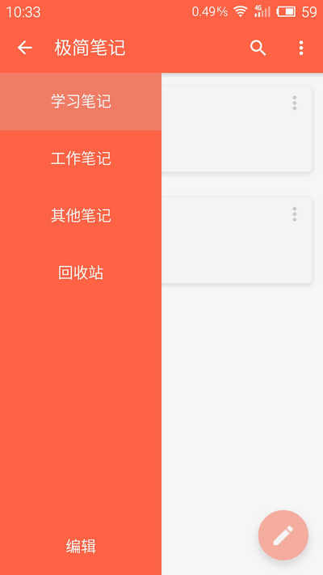
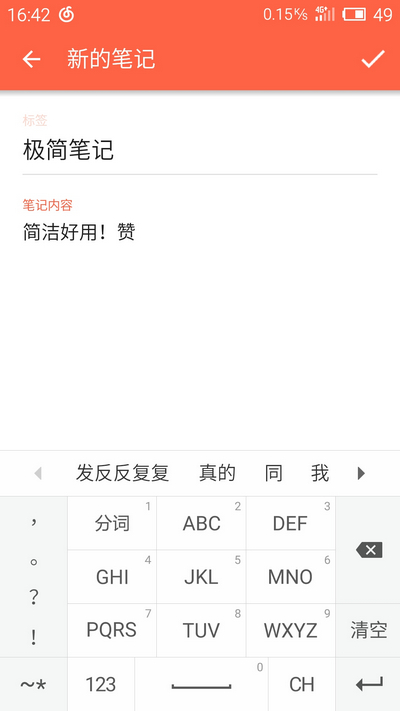
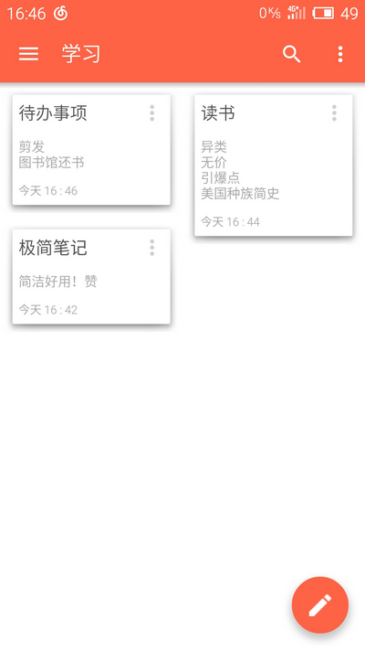
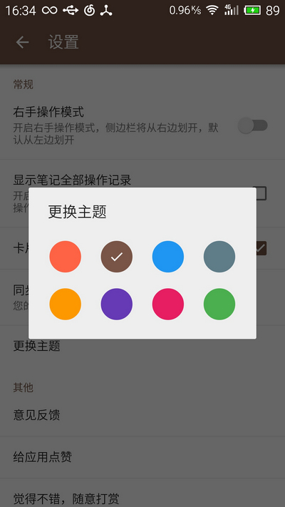
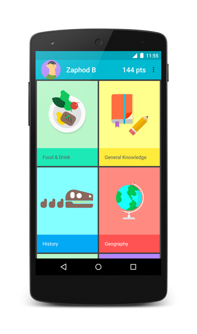
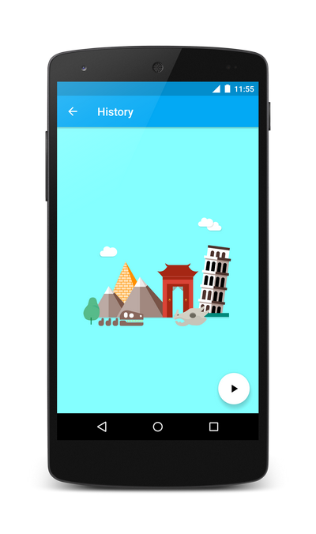
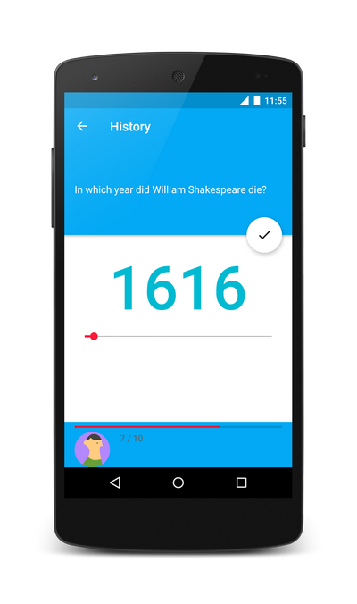
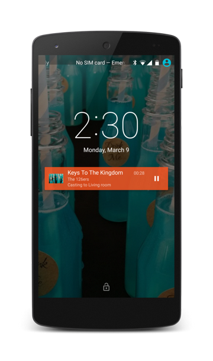
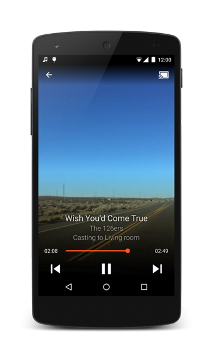

## 第三部分 优秀项目  
主要介绍那些Android还不错的完整项目，目前包含的项目主要依据是项目有意思或项目分层规范比较好。  
1. Linux  
项目地址：https://github.com/torvalds/linux  

1. Android  
项目地址：https://android.googlesource.com/ 或 https://github.com/android  
以上两个项目，不解释  
   
1. ZXing  
二维码扫描工具  
项目地址：https://github.com/zxing/zxing 或 https://code.google.com/p/zxing/  
APK地址：https://play.google.com/store/apps/details?id=com.google.zxing.client.android  
PS：现在市面上很多应用的二维码扫描功能都是从这个修改而来  
   
1. photup  
编辑机批量上传照片到facebook上  
项目地址：https://github.com/chrisbanes/photup  
APK地址：https://play.google.com/store/apps/details?id=uk.co.senab.photup  
PS：代码分包合理，很棒。不过这个项目依赖的开源项目比较多，比较难编译  
     
1. github-android  
Github的Android客户端项目  
项目地址：https://github.com/github/android  
APK地址：https://play.google.com/store/apps/details?id=com.github.mobile  
   
1. Notes  
MIUI便签  
项目地址：https://github.com/MiCode/Notes  
APK地址：https://github.com/Trinea/TrineaDownload/blob/master/miui-note-demo.apk?raw=true  
PS：项目分包比较合理，相比较miui的文件管理器https://github.com/MiCode/FileExplorer 代码规范较好得多  
   
1. weicuiyuan  
四次元-新浪微博客户端  
项目地址：https://github.com/qii/weiciyuan  
APK地址：https://play.google.com/store/apps/details?id=org.qii.weiciyuan  
   
1. gnucash-android  
一个记账理财软件  
项目地址：https://github.com/codinguser/gnucash-android  
APK地址：http://play.google.com/store/apps/details?id=org.gnucash.android  
   
1. AntennaPod  
支持rss订阅、音乐订阅  
项目地址：https://github.com/danieloeh/AntennaPod  
APK地址：https://play.google.com/store/apps/details?id=de.danoeh.antennapod  
   
1. ChaseWhisplyProject  
打鬼游戏  
项目地址：https://github.com/tvbarthel/ChaseWhisplyProject  
APK地址：https://play.google.com/store/apps/details?id=fr.tvbarthel.games.chasewhisply  
   
1. Tweet Lanes  
功能完整的Twitter客户端  
项目地址：https://github.com/chrislacy/TweetLanes  
APK地址：https://play.google.com/store/apps/details?id=com.tweetlanes.android  

1. Financius  
简单易用的记账程序  
项目地址：https://github.com/mvarnagiris/Financius  
APK地址：https://play.google.com/store/apps/details?id=com.code44.finance  

1. todo.txt-android  
todo.txt的官方Android应用  
项目地址：https://github.com/ginatrapani/todo.txt-android  
APK地址：https://play.google.com/store/apps/details?id=com.todotxt.todotxttouch  

1. simpletask  
基于todo.txt官方应用的另一个客户端  
项目地址：https://github.com/mpcjanssen/simpletask-android  
APK地址：https://play.google.com/store/apps/details?id=nl.mpcjanssen.todotxtholo  

1. Muzei Live Wallpaper  
定时更换桌面精美壁纸  
项目地址：https://github.com/romannurik/muzei  
APK地址：https://play.google.com/store/apps/details?id=net.nurik.roman.muzei  

1. rox-android  
一个Material Design风格的基于用户和朋友喜欢的地点给游客推荐兴趣地点的App。  
项目地址：https://github.com/dan-zx/rox-android  
效果图：  

1. Notes  
一款基于Material Design 的开源笔记本应用。不是小米Notes  
项目地址：https://github.com/lguipeng/Notes  
效果图：  

1. StickerCamera   
一个完整的开源项目.贴纸标签相机(类似nice,in),拍照,裁剪,贴贴纸打标签功能.  
项目地址：https://github.com/Skykai521/StickerCamera  
效果图：  

1. 验证码助手 SmsCodeHelper  
是由原「贝壳单词」团队开发的一款新的开源轻App.  
它可以在手机接收到验证码短信的时候，自动浮现验证码，并自动复制验证码到用户的剪切板。当用户接收到短信验证码，只要长按验证码的输入框，粘贴验证码即可。  
项目地址：https://github.com/drakeet/SmsCodeHelper

1. android-topeka  
Google 放出的一个 Material Design 的演示 APP 源代码。  
项目地址：https://github.com/googlesamples/android-topeka  
效果图： 

1. DashClock  
romannurik大神开发的锁屏widget，支持4.2系统以上。  
项目地址：https://github.com/romannurik/dashclock  
Google Play：https://play.google.com/store/apps/details?id=net.nurik.roman.dashclock

1. Google Santa Tracker for Android  
Google开源的一个带有教育和娱乐性质的App，应该是圣诞节给孩子们玩的小应用，里面有三个小游戏，另还有个Android Wear的Demo.  
项目地址：https://github.com/google/santa-tracker-android

1. android-UniversalMusicPlayer  
Google官方Sample，一款播放器，UI和交互都超级棒，而且同时支持手机、平板和Android Wear。  
项目地址：https://github.com/googlesamples/android-UniversalMusicPlayer
效果图： 

1. Timber  
一个很漂亮的Material Design风格音乐播放器  
项目地址：https://github.com/naman14/Timber
效果图： 
  
  
  
  

