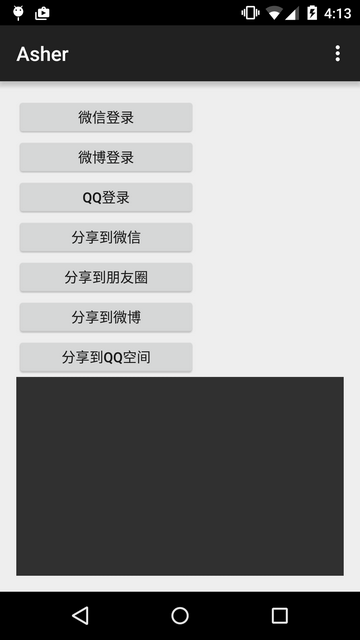

## 第六部分  
其他一些库或者开源的代码  

#### 一、Adapter  
1. base-adapter-helper
重新定义ViewHolder，使Adapter更简单
Github地址：https://github.com/JoanZapata/base-adapter-helper

#### 二、其他
1. ShareLoginLib  
第三方分享登录组件.  
项目地址：https://github.com/lingochamp/ShareLoginLib  
效果图：  

1. android-intents  
对Intent进行了2次封装，包含有EmailIntents、PhoneIntents、GeoIntents、SystemIntents、MediaIntents等。  
项目地址：https://github.com/marvinlabs/android-intents

1. 带壳截图  
这是一个为手机截屏而服务的图片合成工具，基于 Device Frame Generator 开源项目二次开发。它可以为平淡无奇的截屏图片套上等比例的手机设备外框，生成一张媲美广告的渲染图  
项目地址：https://github.com/makohill/dkjt  
Google Play：https://play.google.com/store/apps/details?id=com.sspai.dkjt
